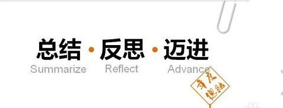

用一句话来总结，“2016年的自己，状态极其不稳定，一事无成”。
年初定下宏伟目标，说要完成多少读书量，要完成多少写作量，要把CPA考过，要精进自己的英语水平。年底了，才发现，自己一件事都没有做好，没错，并没有完成任何计划。我在得过且过的浪费光阴，沉浸在自己的意想之中，没有行动。
<!-- more -->
年初，意外有了宝宝。这并不在自己的计划之中，导致自己手忙脚乱，不知所措，计划被打乱。不得不考虑结婚相关的事宜，但由于自己把控事情的能力真是太差了，导致事情一团乱。婚礼并不没部署成自己想要的样子，一直梦想着的婚纱照也没有拍成，个人情绪时好时坏，人际关系一团糟。此为其一。
事情超出了自己的控制后，导致自己经济状态一团糟。不得不接受出差的工作，所以并没有照顾好怀孕的妻子，还经常觉得她不理解自己，矛盾不断，心情一直很郁闷，不知道如何面对突然发生的一切。也突然觉得自己好像活得挺自私，大多时候只关心自己的心情，并没有真正站在对方的角度思考问题。此其二。
不能处理以上事情后，苦闷郁结心下，只能借着无聊的电视，电影度过。计划要看的书，要学的技术也荒废了，并没有真正精进下去。每个周一本书，精进自己的银行业务知识，学经济学。种种情况，都让我抛之脑后。白白浪费了很多好时光。此其三也。
做事情总是犹犹豫豫，不能果断下决定。一件事情总是在心中纠结很久很久，而不能解决。年中有好几个机会在自己眼前，都没能好好把握。面试通过了两家比较好的公司，但由于自己的种种担心，种种顾虑，导致自己拒绝了这些机会，现在想想，有点后悔。还像个孩子，不能判断什么对自己才是最有利的。此其四也。
以上种种，都导致了自己2016年的极度失败。唯一安慰的是，此刻，身边有了一个宝宝。
2017年，不想对自己有什么计划，对自己的要求就两个:
1. 照顾好妻儿
2. 精进大数据技能
3. 精进自己的外语

计划不如变化快。把自己手头上的事做好，才是对自己最大的安慰。
