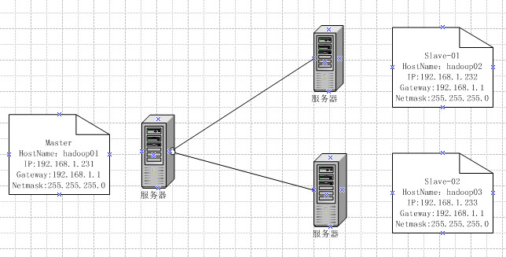
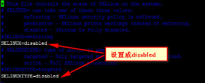
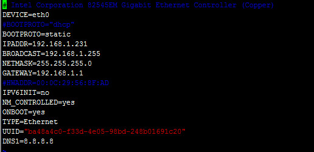
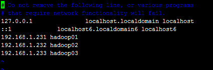
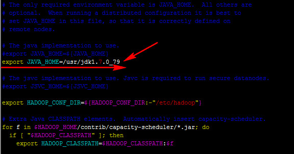
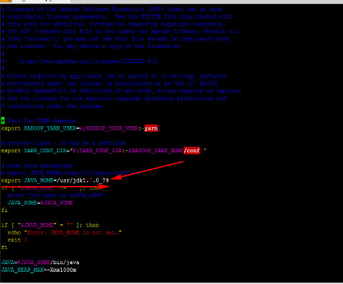

## 1 部署所需软件 ##
- 操作系统：rhel-server-5.4-x86_64-dvd.iso
- JDK：jdk-7u79-linux-x64.tar.gz
- Hadoop：hadoop-2.5.1.tar.gz
- 远程连接工具：Xmanager Enterprise
- 虚拟机：vmware
- 开发工具：eclipse
<!-- more -->
## 2 Hadoop 2.x集群网络拓扑 ##
- 一个master节点，即namenode节点
- 二个slave节点，即二个datanode节点
 

## 3 安装VMware及Linux操作系统 ##
此处省略，可参照网上相关教程
虚拟机网络配置可参考《虚拟机NetworkAdapter三种方式的区别》
## 4 操作系统环境配置 ##
### 4.1 添加用户yangql ###
```
[root@hadoop01 ~]# useradd yangql //yangql为用户名
[root@hadoop01 ~]# passwd yangql
Changing password for user yangql.
New UNIX password:
BAD PASSWORD: it is based on a dictionary word
Retype new UNIX password:
passwd: all authentication tokens updated successfully.
```
### 4.2 关闭防火墙 ###
```
[root@hadoop01 ~]# vim /etc/selinux/config
```

```
[root@hadoop01 ~]# service iptables stop #停止
[root@hadoop01 ~]# chkconfig iptables off #关闭
[root@hadoop01 ~]# service iptables status #查看状态
```
### 4.3 虚拟机IP地址配置 ###
- 修改文件network
```
[root@hadoop01 sysconfig]# vim /etc/sysconfig/network
```

- 修改文件ifcfg-eth0
```
[root@hadoop01 network-scripts]# vim /etc/sysconfig/network-scripts/ifcfg-eth0
```

- 修改hosts文件
```
[root@hadoop01 ~]# vim /etc/hosts
```

### 4.4 Linux免密设置 ###
详见文档《Linux添加SFTP公钥步骤》
http://yangql.cn/2017/01/01/Linux%E6%B7%BB%E5%8A%A0SFTP%E5%85%AC%E9%92%A5%E6%AD%A5%E9%AA%A4/#more
### 4.5 JDK安装 ###
- 将jdk安装包在宿主机中解压然后上传至虚拟机中，也可以上传压缩包到虚拟机中解压。本教程采用解压后，用ssh工具上传
- 上传解压命令
```
tar -xvf jdk-7u79-linux-x64.tar.gz
```
- 新解压的文件复制到/usr/目录下
- 配置JDK环境
```
[yangql@hadoop01 ~]$ vim .bash_profile
```
```
export JAVA_HOME=/usr/jdk1.7.0_79
export PATH=$PATH:$JAVA_HOME/bin
export CLASSPATH=.:$JAVA_HOME/lib/dt.jar:$JAVA_HOME/lib/tools.jar
```
- 配置生效
```
source .bash_profile
```
- 验证JDK是否成功
```
[yangql@hadoop01 ~]$ java -version
java version "1.7.0_79"
Java(TM) SE Runtime Environment (build 1.7.0_79-b15)
Java HotSpot(TM) 64-Bit Server VM (build 24.79-b02, mixed mode)
```
## 5 Hadoop2.5.1安装 ##
### 5.1 下载并上传 ###
下载最新版本的HadoopHadoop2.5.1，并上传至/home/yangql目录。解压。
```
tar -zxf hadoop-2.5.1.tar.gz
```
解压完成后，需要配置各种文件，其中包括:
```
/hadoop-2.5.1/etc/hadoop/hadoop-env.sh
/hadoop-2.5.1/etc/hadoop/yarn-env.sh
/hadoop-2.5.1/etc/hadoop/slaves
/hadoop-2.5.1/etc/hadoop/core-site.xml
/hadoop-2.5.1/etc/hadoop/hdfs-site.xml
/hadoop-2.5.1/etc/hadoop/mapred-site.xml
/hadoop-2.5.1/etc/hadoop/yarn-site.xml
/etc/.bash_profile
```
### 5.2 hadoop-env.sh文件，修改jdk路径 ###
配置参数：export JAVA_HOME=/usr/jdk1.7.0_79

### 5.3 配置yarn-env.sh文件，修改jdk路径 ###
配置参数：export JAVA_HOME=/usr/jdk1.7.0_79

### 5.4 配置slaves文件 ###
```
hadoop02
hadoop03
```
### 5.5 配置core-site.xml文件 ###
```
<configuration>
  <property>
    <name>hadoop.tmp.dir</name>
    <value>/home/yangql/data/tmp</value>
  </property>
  <property>
    <name>fs.default.name</name>
    <value>hdfs://hadoop01:9000</value>
  </property>
</configuration>
```
注：临时数据存放文件夹的权限要设置读写权限，否则初始hadoop会报错
### 5.6 配置hdfs-site.xml ###
```
<configuration>
  <property>
    <name>dfs.http.address</name>
    <value>hadoop01:50070</value>
  </property>
  <property>
    <name>dfs.namenode.secondary.http-address</name>
    <value>hadoop01:50090</value>
  </property>
  <property>
    <name>dfs.replication</name>
    <value>2</value>
  </property>
</configuration>
```
### 5.7 配置mapred-site.xml ###
mapred-site.xml文件在hadoop中由mapred-site.xml.template替代，将后缀去掉即可。
```
<configuration>
  <property>
    <name>mapred.job.tracker</name>
    <value>hadoop01:9001</value>
  </property>
  <property>
    <name>mapred.map.tasks</name>
    <value>20</value>
  </property>
  <property>
    <name>mapred.reduce.tasks</name>
    <value>4</value>
  </property>
  <property>
    <name>mapreduce.framework.name</name>
    <value>yarn</value>
  </property>
  <property>
    <name>mapreduce.jobhistory.address</name>
    <value>hadoop01:10020</value>
  </property>
  <property>
    <name>mapreduce.jobhistory.webapp.address</name>
    <value>hadoop01:19888</value>
  </property>
</configuration>
```
### 5.8 配置yarn-site.xml ###
```
<configuration>
  <property>
    <name>yarn.resourcemanager.address</name>
    <value>hadoop01:8032</value>
  </property>
  <property>
    <name>yarn.resourcemanager.scheduler.address</name>
    <value>hadoop01:8030</value>
  </property>
  <property>
   <name>yarn.resourcemanager.webapp.address</name>
   <value>hadoop01:8088</value>
  </property>
  <property>
    <name>yarn.resourcemanager.resourcetracker.address</name>
    <value>hadoop01:8031</value>
  </property>
  <property>
    <name>yarn.resourcemanager.admin.address</name>
    <value>hadoop01:8033</value>
  </property>
  <property>
    <name>yarn.nodemanager.aux-services</name>
    <value>mapreduce_shuffle</value>
  </property>
  <property>
    <name>yarn.nodemanager.aux-services.mapreduce.shuffle.class</name>
    <value>org.apache.hadoop.mapred.ShuffleHandler</value>
  </property>
</configuration>
```
### 5.9 配置.bash_profile，加入hadoop环境 ###
```
export HADOOP_HOME=/home/yangql/hadoop-2.5.1
```
## 6 拷贝到其他节点 ##
```
scp –r  /home/yangql/hadoop-2.5.1 yangql@hadoop002:/home/yangql
scp –r  /home/yangql/hadoop-2.5.1 yangql@hadoop003:/home/yangql
```
## 7 格式化namenode ##
```
格式化命令：./bin/hdfs namenode –format
```
## 8 启动hadoop ##
```
启动hdfs: ./sbin/start-dfs.sh
启动yarn: ./sbin/start-yarn.sh
全部启动 ./sbin/start-all.sh
启动成功后jps看进程
7854 Jps
7594 ResourceManager
7357 NameNode
```
## 9 通过浏览器访问 ##
```
http://192.168.1.231:50070/
http://192.168.1.231:8088/
```
## 10 遇到的问题 ##
### 10.1  WARN util.NativeCodeLoader: Unable to load native-hadoop library for your platform... using builtin-java classes where applicable ###
配置完Hadoop启动的时候出现如下警告信息：
WARN util.NativeCodeLoader: Unable to load native-hadoop library for your platform... using builtin-java classes where applicable
问题在哪里？有人说这是hadoop的预编译包是32bit的，运行在64bit上就会有问题。但是这个答案大多数时候都是错的。
```方案1：重新编译glibc.2.14版本，安装后专门给hadoop使用，这个有点危险。```
```
 方案2：直接在log4j日志中去除告警信息。在/usr/local/hadoop-2.5.1/etc/hadoop/log4j.properties文件中添加
 log4j.logger.org.apache.hadoop.util.NativeCodeLoader=ERROR
```
