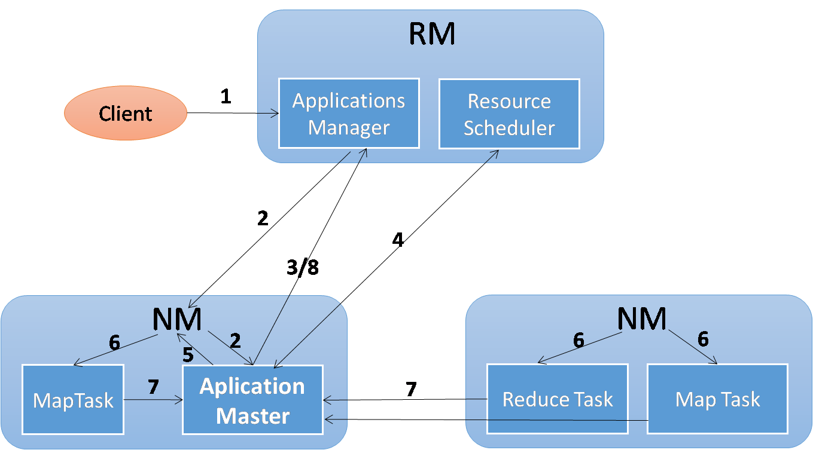

## 1.Hadoop历史 ##
Hadoop最早起源于Nutch，，Nutch是一个开源的搜索引擎,由Doug Cutting在2002年的时候开发完成，原本Nutch的目标是为了构建一个大型的搜索引擎，涵盖网页爬取、索引、查询等一些功能，但随着网页爬取的数量不断增加，此时对于存储和索引就形成了比较严重的瓶颈问题。此时，Google发表了三篇论文:GFS，MapReduce,BigTable，这三篇论文堪称大数据领域的开篇巨作，也由此拉开了至今为止都非常火热的大数据应用。
<!-- more -->
2003年google首先发表了GFS（Google File System），
这篇文章描述了Google网页爬取相关数据的存储架构，在随后的2004年又发表了分布式计算框架的论文MapReduce（分布式计算框架的核心思想）。基于这三篇论文，Doug Cutting 带领的Nutch团队自己动手开发了一套存储架构叫Nutch Distributed File System(NDFS)和分布式计算框架MapReduce，2006年时，由于这两个项目不仅可以应用于搜索领域，所以Nutch团队将这两个项目从Nutch中移出Nutch，成为Lucene的一个子项目，此时，这个子项目被命名为Hadoop，同时NDFS被更名为HDFS（Hadoop Distributed File System）。与此同时，Doug Cutting加入Yahoo!，组建了一个团队专门开发Hadoop，在2006年的2月，Apache Hadoop项目正式启动使得HDFS和MapReduce独立发展，2年之后，也就是2008年，Hadoop成为了Apache的顶级项目。
## 2.Hadoop架构变化 ##
Hadoop的版本更迭非常快，从0.x到1.x再到现在的2.7.3，主要经历了比较重大的2个MapReduce（后续简称为MR）架构，分别成为MRv1和MRv2。
第一个是在Hadoop 2.x之前的版本MR v1，此时的MR主要有2个服务进程：JobTracker和TaskTracker，Hadoop集群的资源调度和作业调度都是由JobTracker来控制的，这就造成了JobTracker这个服务进程以及运行JobTracker节点的压力过大，容易造成单点故障等问题。
从Hadoop 2.x之后，也就是MR v2开始之后，整个架构对于资源调度和作业调度进行了分离，将原来由JobTracker负责的资源调度和管理分成对于每一个作业运行所需资源的资源协调器来负责，这个资源协调器被称为YARN（Yet Another Resource Negotiator），对于整个集群来说，将资源调度和作业调度分开，也更为合理。在YARN中，由RM负责资源的协调和调度，而运行于从节点上的NM则负责对应Task所需资源的申请和该节点资源使用情况的汇报。
## 3.主要模块 ##
- Hadoop Common，支持Hadoop其他模块的通用工具
- HDFS，Hadoop的分布式文件系统，提供了高吞吐量的数据访问
- YARN，作业调度和资源管理的一个框架
- MapReduce，基于YARN的大数据分布式计算框架
## 4.Hadoop相关概念 ##
- Master：主节点，运行着NameNode、ResourceManager服务进程
- Slave：从节点，运行着DataNode、NodeManager服务进程
- NameNode： NameNode运行于主节点之上，就是被称为Master的节点，负责记录各个数据块的存储空间（NameSpace），与DataNode进行通信，获取其状态信息，并根据决策算法将数据分发到某些节点。
- DataNode：DataNode运行于从节点之上，也就是被称为Slave的节点，负责实际数据的存储，与NameNode进行通信，将其所在节点的存储状态汇报给NameNode，以供其决策。
- HDFS集群：一个HDFS集群包含一个单独的Master节点和多个Slave节点，由一台Master服务器所架设的NameNode，称之为单NameNode集群，两台Master服务器架设成的NameNode，称之为双NameNode集群。
- 单机模式：服务进程运行在一个台机器上，并且文件系统也直接采用本地文件系统，没有分布式文件系统，而是直接读写本地文件，无论是在存储上，还是在计算时，都是由单机完成。所以严格意义上来讲，这样的Hadoop运行模式不能称之为集群，而且单机模式主要用于实验。
- 伪分布式模式：伪分布式模式由一台机器实现的，它通过一个机器上不同的Java进程来模拟分布式中不同节点上的服务进程，这种情况下将文件系统设置成分布式的文件系统，这样即使是一台机器，也可以看成是逻辑上的分布式。
- 分布式模式：伪分布式当中运行的一些服务进程放到另外的一些机器上去运行，例如我们把DataNode和NodeManager放到多个从节点（从服务器）上去运行。就实现了一个真正的分布式模式的Hadoop集群。
## 5.Yarn框架 ##
### 5.1 MRv1 与 MRv2 比较 ###
- MRv1：编程模型：Map阶段和Reduce阶段，数据处理引擎：MapTask和ReduceTask，运行时环境：JobTracker（资源管理和作业控制）和TaskTracker（接受JobTracker命令并具体执行）
- MRv2：
编程模型、数据处理引擎，与MRv1是一样的
唯一不同的是运行时环境。
MRv2是运行于YARN之上的MapReduce计算框架。
YARN（资源管理与调度）和ApplicationMaster（作业控制）。
YARN
支持多种计算框架的资源管理器。
### 5.2 MRv1局限性 ###
- 可扩展性差，同时具备资源管理和作业控制两个功能，集群中的瓶颈。
- 可靠性差，主从架构（Master/Slave架构），其中的主节点存在单点故障，一旦主节点出现问题，将导致集群不可用。
- 资源利用率低，MRv1采用Slot资源分配模式，粗粒度的资源划分单位，通常任务不会用完一个槽的对应资源，且其他任务也无法使用这些空闲资源。
- 无法支持多种计算框架
### 5.3 YARN 优势 ###
- 资源利用率高，
- 运维成为降低
- 数据共享
### 5.4 YARN的基本组成结构 ###
- ResourceManager：全局的资源管理器，负责整个集群的资源管理、分配与调度。
- Scheduler（调度器），纯调度器，默认下是Fair Scheduler
- NodeManager：对每一个slave上的资源和任务做管理 ，定时的向ResourceManager汇报HearBeat（资源的使用情况和Container的运行状态），接受来自ApplicationMaster的启动/停止的请求
- Container：资源分配单位（MRv1中Slot），动态分配。
- ApplicationMaster：每个APP都会包含一个 ApplicationMaster,ApplicationMaster 的功能包括：
1） 向ResourceManager申请资源（用Container资源抽象）
2） 将任务做进一步的分配
3） 与NodeManager通信启动/停止任务
4） 跟踪每一个Task的运行状态（包括Failed后的操作）
### 5.5 YARN的通信协议 ###
- Client与RM通信的协议，作业的提交、应用程序的状态等。
- AM与RM通信协议，向RM注册AM，申请资源。
- AM与NM通信协议，启动/停止Container。
- RM与NM通信协议,汇报slave节点的资源信息包括Container的状态（运行状况）
### 5.6 YARN的工作流程 ###
- 短作业，作业运行几秒、几分、几小时或几天……会正常结束的作业；
- 长作业，如无意外，永远不停止的作业（服务部署）
向YARN提交一个作业（或应用程序）：YARN的运行过程:

1，客户向YARN提交Application
2，RM为这个应用程序分配一个Container（某个NM上），RM要求该NM在分配的Container上启动应用程序的ApplicationMaster（AM）
3，AM向RM注册自己
4，AM向RM申请资源
5，与RM分配资源的NM通信，要求其启动Task
6，NM设置好运行环境之后启动任务
7，各Task向AM汇报进度和状态
8，程序运行完毕，AM向RM注销并关闭自己。
