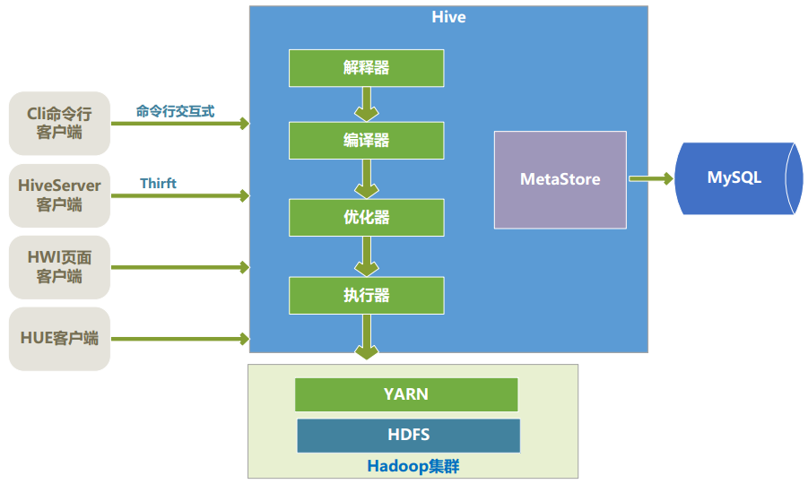

## 1.Hive介绍 ##
Hive是Facebook为了解决海量日志数据的分析而开发的。是一种用SQL来协助读写、管理存储在分布式存储系统上的大数据集的数据仓库软件，主要有以下几个特点:
- 通过类SQL来分析大数据，避免了写MapReduce来分析数据，这样使得数据分析更容易。
- 数据是存储在HDFS上的，Hive本身并不存储数据
- Hive将数据映射成数据库和一张张表，库和表的元数据一般存储在关系数据库中。
- 能存储很大的数据集，并对数据的完整性，格式要求不严格。
- 不适用与实时计算和响应，使用于离线分析。
注：后续搭建HUE平台
<!-- more -->
## 2.Hive基本数据类型 ##
Hive支持大多数的数据类型：

|数据类型|长度|备注|
|:-----|:---|:------|
|TinyInt|1字节的有符号整数|-128~127|
|SmallINt|2字节的有符号整数|-32768~32767|
|Int|4字节的有符号整数||
|BigInt|8字节的有符号整数||
|Boolean|布尔类型|true,false|
|Float|单精度||
|Double|双进度||
|String|字符串||
|Timestamp|||
|Binary|字节数组||
|Date|日期| ||

## 3.Hive DDL 数据定义 ##
### 3.1.创建数据库 ###
创建一个数据库就是在HDFS上创建一个目录，数据库类似命名空间来组织表，在大量Hive表的情况下，避免表名冲突，默认数据库是default
创建数据库
```
create database if not exists dealer_db;
```
### 3.2.查看数据库定义 ###
```
hive> desc database dealer_db;
OK
dealer_db		hdfs://hadoop01:9000/user/hive/warehouse/dealer_db.dyangql	USER
Time taken: 0.69 seconds, Fetched: 1 row(s)
hive>
```
### 3.3.查看数据库列表 ###
```
hive> show databases;
OK
dealer_db
default
hello
pactera
Time taken: 0.05 seconds, Fetched: 4 row(s)
hive>
```
### 3.4.删除数据库 ###
删除数据库时，如果库中存在表，是不能删除的，要先删除所有表，再删除数据库。添加上参数 `cascase`后，就可以先自动删除表，再删除数据库，删除数据库后，HDFS上数据库对应的目录就被删除了。
```
drop database test;
drop database test cascade;
```
### 3.5.切换数据库 ###
```
use dealer_db;
```
### 3.6.创建普通表 ###
row format delimited fields terminated by '\t',指定列之间的分隔符，stored as textfile指定文件的存储格式为textfile，创建表的集中方式：
- create table
- create table as select :根据查询结果创建表，并将查询结果数据插入到信件的表中。
- create table like table_name :克隆表，只复制table_name的表结构。
```
create table if not exists dealerinfo(
dealerid int,
dealername string,
cityid int,
createtime date
)
row format delimited
fields terminated by '\t'
stored as textfile
```

### 3.7.创建分区表 ###
Hive查询一般是扫描整个目录，但有时我们关心的数据只是集中在某一部分数据上，比如我们查询某一天的数据时，可以使用分区表来优化，一天一个分区，Hive只扫描指定天分区的数据。  
普通表和分区表的区别在于，一个Hive表在HDFS上有一个对应的目录来存储数据，普通表的数据直接存储在这个目录下，而分区表数据存储时，是再划分子目录来存储的。一个分区一个子目录。主要的作用是用来查询优化性能。
```
create table dealer_log(
companyid int comment 'commpany id',
userid int comment 'user id',
invisttime string comment 'invist time'  
)
partitioned by (dt string)
row format delimited
fields terminated by '\t'
stored as textfile
```
在上面列子中，这个日志表是以dt字段分区，dt是个虚拟字段，dt下并未存储数据，而是用来分区的，实际数据存储时，dt字段一样的值存入同一个子目录中。所以对于分区表，尽量添加分区字段来过滤筛选。

### 3.8.创建桶表 ###
桶表也是一种用于优化查询而设计的表，创建普通表时，指定桶的个数，分桶的依据字段，hive就会自动将数据分桶存储，查询时只需要遍历一个桶里的数据，或者遍历部分桶，提高查询效率。
```
create table dealer_leads(
leads_id string,
dealer_id string,
user_id string,
user_phone string,
create_time string
)
clustered by(dealer_id) sorted by(leads_id) into 10 Buckets
row format delimited
fields terminated by '\t'
stored as textfile
```
- clusterd by 是指根据dealer_id进行hash后mo模除分桶个数，根据得到的结果，确定这行数据分入到那个桶中，这样的分发，可以确保相同的dealer_id的数据放入到同一个桶中，而dealer_id的数据，大部分根据dealer_id查询，这样大部分情况下只需要查询一个桶中的数据就行了。
- sorted by是指根据桶中的那个字段进行排序，排序的好处，就是join操作的时候能获得很高的效率。
- into 10 Buckets 是指一共分多少桶
- 在HDFS上存储时，一个桶存入一个文件中，这样根据dealer_id查询时，可以快速确定数据存在与那个桶中，遍历一个桶可以提高查询速度。  

### 3.9.查看表 ###
- 查看库中所有表
```
show tables ;
show tables '*info';//可以用正则表达式筛选
```
- 查看表的详情
```
desc dealer_log;
desc formatted dealer_log;
```

### 3.10.修改表 ###
修改表包括修改表名，添加字段，修改字段。
- 修改表名
```
alter table dealerinfo rename to dealer_info;
```
- 添加字段
```
alter table dealer_info add columns(provinceid int);
```
- 修改字段
```
alter table dealer_info change dealerid dealer_id int;
```

### 3.11.删除表 ###
```
drop table if exists test;
```

## 4.Hive DML数据管理 ##
### 4.1.将数据加载到普通表 ###
可以将本地数据文件批量加载到Hive表中，要求文本中的格式要与Hive表的定义一致，包括：字段个数，顺序，列分隔符
```
load data local inpath '/home/yangql/user_tab_comments.txt' overwrite into table user_tab_comments
```
- local 关键字表示源数据文件在本地，源文件可以在HDFS上，如果在HDFS上，则去掉local，inpath后面的路径类似：hdfs://namenode:9000/user/datapath
```
hive> load data  inpath '/input/user_tab_comments.txt' overwrite into table user_tab_comments;
```
- overwrite表示如果hive表中有数据，就会覆盖掉原有的数据，如果省略掉overwrite,默认是追加数据。  

### 4.2.将数据加载到分区表 ###
```
load data inpath 'hdfs://hadoop01:9000/input/yangql/dealer_log.txt' overwrite into table dealer_log partition(dt='2017-03-03')
```

### 4.3.将数据加载到分桶表 ###
- 先创建普通临时表
```
create table dealer_leads_tmp(
  leads_id string,
  dealer_id string,
  user_id string,
  user_phone string,
  create_time string
  )
  row format delimited
  fields terminated by '\t'
  stored as textfile;
```
- 载入临时表
```
load data local inpath '/home/yangql/dealer_leads.txt' overwrite into table dealer_leads_tmp
```
- 导入分桶表
```
set hive.enforce.bucketing = true;
insert overwrite table dealer_leads select * from dealer_leads_tmp;
```

### 4.4.数据导出 ###
- 导出数据，将Hive表中的数据导出到本地文件中
```
insert overwrite local directory '/home/yangql/dealer_leads-20170302.txt' select * from dealer_leads;
```
- 导出到HDFS
```
insert overwrite  directory '/input/yangql/dealer_leads-20170302.txt' select * from dealer_leads;
```

### 4.5.插入数据 ###
- inset select(overwrite:覆盖，去掉后表示追加数据)
```
insert overwrite table_name select * from table_name;
```
- 插入分区表
```
insert overwrite table dealer_log partition(dt='2016-10-21') select * from dealer_leads_tmp;
```
- 一次遍历，多次插入
```
from dealer_log
insert overwrite table log1 partition(dt='2017-03-04') select companyid,userid,invisttime
insert overwrite table log2 partition(dt='2017-03-04') select companyid,userid,invisttime;
```
- 复制表
复制表可以将表的结构和数据复制并创建为一个新表，复制过程中，可以对数据进行筛选，列可以进行删减。
```
create table dealer_logbak
row format delimited
fields terminated by '\t'
stored as textfile
as
select * from dealer_log
```
- 克隆表(只有表结构，不含具体数据)
```
create table dealer_logbak01 like dealer_log;
```
- 备份表（备份表是将表的元数据和数据都导出到HDFS）
```
export table dealer_log to '/input/yangql/dealer_log_bak.export'
```
- 还原表
```
import table dealer_log_0302 from '/input/yangql/dealer_log_bak.export'
```
## 5.HiveQL 数据查询语法 ##
数据查询很多跟关系数据库一样，这里只列举部分：
- 限制查询条数
```
select * from table_name limit 10;
```
- RLike 正则表达式匹配
- Hive对子查询的支持有限，只允许在select from 后面出现。
- Hive join 连接只能支持等值连接（on a.id=b.id），不支持不等值连接(on a.id!=b.id)。支持inner join ,left join ,right join ,full join
- 连接谓词中不支持 or
- left semi-join(Hive sql 中不存在exists)，左半开连接，但是select后面的列只能是左边的列，不能有右边的列。
- 排序，order by 。order by这样操作，肯定是Map后汇总到一个reduce上执行，如果数据量打大，会造成reduce执行过程相当长，所以，Hive中尽量不用Order by，除非能确认数据量很小。
- sort by：sort by是在每个reduce中进行排序，是一个局部排序，可以保证每个reduce中是进行排序好的。但从全局来看不一定是排序的。
- distribute by 和sort by：distribute by是指定map输出结果怎样划分后分配到各个reduce上去。然后再指定sort by。这种也不能做到全局排序，只能保证排序字段值相同的放在一起，并且在reduce局部上是排序好的。distribute by 必须在sort by 之前。
- cluster by：如果distribute by和sort by的字段是同一个，那可以用cluster by来替换。
- 自定义函数：Java编写，继承UDF类并实现evaluate()

## 7.hive-架构##


(1) Hive 的核心是驱动引擎：
- 解释器：将Hive SQL 转化为语法树（AST）
- 编译器：将语法树编译为逻辑执行计划
- 优化器：将逻辑执行计划进行优化
- 执行器：调用底层的运行框架执行逻辑执行计划     

(2) Hive 的底层存储
Hive的数据是存储在HDFS上的，Hive中的库和表可以看作是对HDFS上的数据的一个映射，Hive运行在Hadoop集群上。  
(3) Hive 程序的执行过程
Hive中的执行器，是将最终要执行的MapReduce程序放在Yarn上以一系列的方式去执行。  
(4) Hive的元数据一般是存储在Mysql这种关系数据库上的。Hive和Mysql通过metaStore服务交互。
## 8.Hive SQL 优化 ##
- 利用分区表优化
- 利用桶表优化
- join优化  

(1)优先过滤后再join，最大限度的减少参与Join的数据量。  
(2)小表JOIN大表的原则，应该遵守小表JOIN大表的原则，原因是Join操作的reduce阶段，位于Join左边的表的内荣会被加载近内存，将条目少的放在左边，可以减少OOM发生的几率。JOIN中执行顺序是从左到右生成Job。  
(3)Hive中，当多个表进行Join时，如果join on 条件相同，那么他们会合并为一个Mapreduce，所以利用这个特性，可以将相同的join on的放入一个job来节省执行时间。  
(4)启用mapjoin，mapjoin是将join双方比较小的表直接分发到各个map进程的内存中。在map进程中进行map操作，这样就省掉了reduce步骤，提高了速度。  
(5)桶表mapjoin  
(6)group by 数据倾斜优化：Group By 很容易导致数据倾斜问题，因为实际业务中，通常是数据集中在某些点上，这也符合常
见的 2/8 原则，这样会造成对数据分组后，某一些分组上数据量非常大，而其他的分组上数据量
很小，而在 mapreduce 程序中，同一个分组的数据会分配到同一个 reduce 操作上去， 导致某一
些 reduce 压力很大，其他的 reduce 压力很小，这就是数据倾斜， 整个 job 执行时间取决于那个
执行最慢的那个 reduce。解决这个问题的方法是配置一个参数： `set hive.groupby.skewindata=true。`
当选项设定为 true，生成的查询计划会有两个 MR Job。第一个 MR Job 中， Map 的输出结果会
随机分布到 Reduce 中，每个 Reduce 做部分聚合操作，并输出结果，这样处理的结果是相同的
Group By Key 有可能被分发到不同的 Reduce 中，从而达到负载均衡的目的；第二个 MR Job
再根据预处理的数据结果按照 Group By Key 分布到 Reduce 中（这个过程可以保证相同的
GroupBy Key 被分布到同一个 Reduce 中），最后完成最终的聚合操作。  
(7)order by优化： order by 只能是在一个 reduce 进程中进行的，所以如果对一个大数据集进行 order by,会
导致一个 reduce 进程中处理的数据相当大， 造成查询执行超级缓慢。 在要有进行 order by 全局
排序的需求时， 用以下几个措施优化：(1) 在最终结果上进行 order by，不要在中间的大数据集上进行排序。 如果最终结果较少， 可以
在一个 reduce 上进行排序时，那么就在最后的结果集上进行 order by。(2) 如果需求是取排序后前 N 条数据， 那么可以使用 distribute by 和 sort by 在各个 reduce 上进行排
序后取前 N 条， 然后再对各个 reduce 的结果集合并后在一个 reduce 中全局排序， 再取前 N 条， 因为参与
全局排序的 Order By 的数据量最多有 reduce 个数*N
```
select a.leads_id,a.user_name from
(
select leads_id,user_name from dealer_leads
distribute by length(user_name) sort by length(user_name) desc limit 10
) a order by length(a.user_name) desc limit 10;
```
(8)Group By Map 端聚合
并不是所有的聚合操作都需要在 Reduce 端完成，很多聚合操作都可以先在 Map 端进行部分聚合，最后在 Reduce 端得出最终结果。
```
hive.map.aggr = true 是否在 Map 端进行聚合，默认为 True。
hive.groupby.mapaggr.checkinterval = 100000 在 Map 端进行聚合操作的条目数目
```  
(9)一次读取多次插入  
(10)Join 字段显示类型转换  
(11)使用 orc、 parquet 等列式存储格式  
创建表时，尽量使用 orc、 parquet 这些列式存储格式， 因为列式存储的表， 每一列的数据在物
理上是存储在一起的， Hive 查询时会只遍历需要列数据， 大大减少处理的数据量
## 9.Hive文件格式 ##
Hive 中的文件格式常见的有： textfile 文件格式、 sequencefile 二进制序列化文件格式、 rcfile、
orc、 parquet。 hive 表的文件格式一般是在创建表时用 stored as 语句声明，其中 textfile 和 sequencefile 是以行存储数据的， rcfile、 orc、 parquet 是列式存储的。

### 9.1.TextFile 格式 ###
TextFile 是 Hive 的默认文件格式， 数据不做压缩， 磁盘开销比较大， 数据解析时开销也比较
大。 从本地文件向 Hive load 数据只能用 textfile 文件格式。

### 9.2.SequenceFile 格式 ###
SequenceFile 是 Hadoop API 提供的一种二进制文件支持， 其具有使用方便、 可分割、 可压缩的
特点。

### 9.3.Rcfile 格式 ###
Rcfile 是一种行列存储结合的存储方式， 首先将数据按行分块， 保证同一个记录在一个块上， 避
免读取一行记录需要读取多个块的情况， 然后块数据列式存储，这样有利于数据压缩和列存取。

### 9.4.Orc 格式 ###
Orc 格式是 Rcfile 格式的升级版， 性能有很大的提升， 并且数据可以压缩存储， 比 textfile 文
件压缩比可以达到 70%，同时读取性能也非常高，推荐使用 orc 文件格式创建表。

### 9.5。Parquet 格式 ###
Parquet 是一种适合多种计算框架的文件格式， Parquet 是语言无关的，并且不与任何一种数据处
理框架绑定在一起，适配多种语言和组件，能够与 parquet 配合的组件有：
查询引擎： Hive、 Impala、 Pig、 Presto、 Drill、 Tajo、 HAWQ、 IBM Big SQL。
计算框架： MapReduce、 Spark、 Cascading、 Crunch、 Scalding、 Kite
所以如果一套数据要多种引擎使用， Parquet 是最好的选择。
