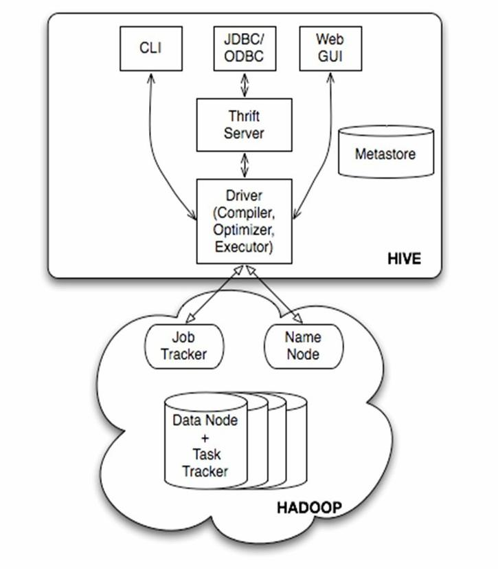
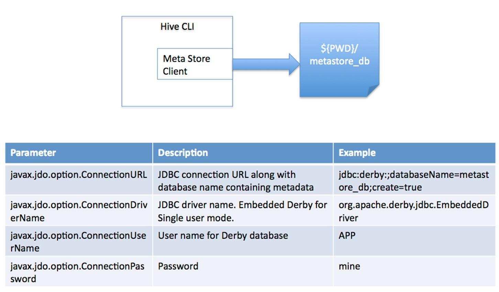
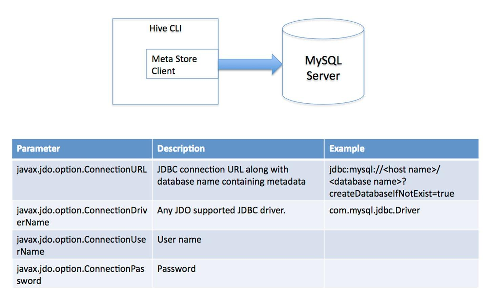
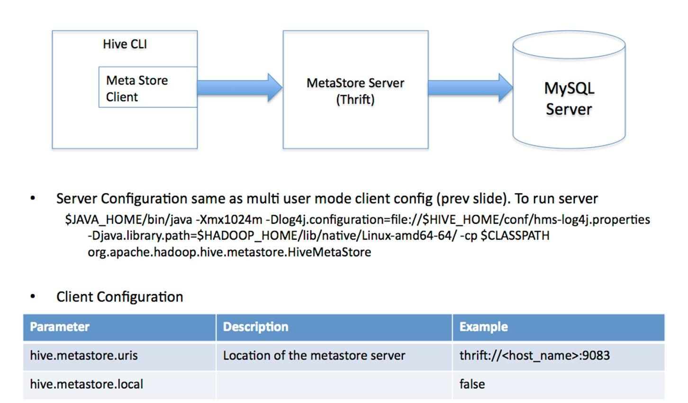
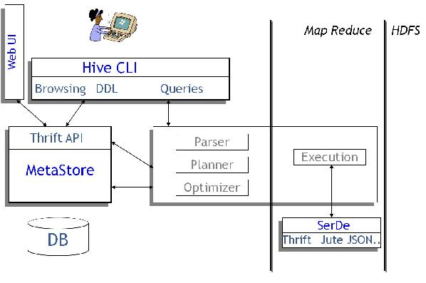

## 1.Hive介绍 ##
- 在Hadoop生态圈中属于数据仓库的角色。Hive能够管理Hadoop中的数据，同时可以查询Hadoop中的数据。它提供了一系列的工具，可以用来进行数据提取转化加载（ETL），这是一种可以存储、查询和分析存储在Hadoop中的大规模数据的机制。
- Hive定义了简单的类SQL查询语言，称为HQL ，它允许熟悉SQL的用户查询数据。同时，这个语言也允许熟悉MapReduce开发者的开发自定义的mapper和reducer来处理内建的mapper和reducer无法完成的复杂的分析工作。
- 本质上讲，Hive是一个SQL解析引擎。Hive可以把SQL查询转换为MapReduce中的job然后在Hadoop执行。Hive有一套映射工具，可以把SQL转换为MapReduce中的job，可以把SQL中的表、字段转换为HDFS中的文件(夹)以及文件中的列。这套映射工具称之为metastore，一般存放在derby、mysql中。
- Hive的表其实就是HDFS的目录，按表名把文件夹分开。如果是分区表，则分区值是子文件夹，可以直接在M/R的Job里使用这些数据。    
<!-- more -->

## 2.Hive的体系架构 ##

- 用户接口主要有三种：CLI，Client 和 WebUI。其中最常用的是CLI，CLI启动的时候，会同时启动一个Hive副本。Client是Hive的客户端，用户连接至Hive Server。在启动 Client模式的时候，需要指出Hive Server所在节点，并且在该节点启动Hive Server。WebUI是通过浏览器访问Hive
- Hive将元数据存储在数据库中，如mysql、derby。Hive中的元数据包括表的名字，表的列和分区及其属性，表的属性（是否为外部表等），表的数据所在目录等
- 解释器、编译器、优化器完成HQL查询语句从词法分析、语法分析、编译、优化以及查询计划的生成。生成的查询计划存储在HDFS中，并在随后有MapReduce调用执行
- Hive的数据存储在HDFS中，大部分的查询、计算由MapReduce完成（包含*的查询，比如select * from tbl不会生成MapRedcue任务）
- Hive将元数据存储在RDBMS中  

## 3.Hive的连接模式 ##
### 单用户模式：###
连接到一个In-memory 的数据库Derby，一般用于Unit Test

### 多用户模式： ###
通过网络连接到一个数据库中，是最经常使用到的模式【生产模式】

### 远程服务器模式：###
用于非Java客户端访问元数据库，在服务器端启动MetaStoreServer，客户端利用Thrift协议通过MetaStoreServer访问元数据库


## 4.Hive数据存储 ##
对于数据存储，Hive没有专门的数据存储格式，也没有为数据建立索引，用户可以非常自由的组织Hive中的表，只需要在创建表的时候告诉Hive数据中的列分隔符和行分隔符，Hive就可以解析数据。Hive中所有的数据都存储在HDFS中，存储结构主要包括数据库、文件、表和视图。Hive中包含以下数据模型：Table内部表，External Table外部表，Partition分区，Bucket桶。Hive默认可以直接加载文本文件，还支持sequence file 、RCFile。
### Hive数据库：###
类似传统数据库的DataBase，在第三方数据库里实际是一张表。简单示例命令行 hive > create database databasetest;
### 内部表：###
Hive的内部表与数据库中的Table在概念上是类似。每一个Table在Hive中都有一个相应的目录存储数据。例如一个表test，它在HDFS中的路径为/input/test，其中input是在hive-site.xml中由${hive.metastore.warehouse.dir} 指定的数据仓库的目录，所有的Table数据（不包括External Table）都保存在这个目录中。删除表时，元数据与数据都会被删除。
```
内部表简单示例：
创建数据文件：test_table.txt
创建表：create table test_table (key string)
加载数据：LOAD DATA LOCAL INPATH ‘filepath’ INTO TABLE test_table
查看数据：select * from test_table;  select count(*) from test_table
删除表：drop table test_table
```
### 外部表: ###
外部表指向已经在HDFS中存在的数据，可以创建Partition。它和内部表在元数据的组织上是相同的，而实际数据的存储则有较大的差异。内部表的创建过程和数据加载过程这两个过程可以分别独立完成，也可以在同一个语句中完成，在加载数据的过程中，实际数据会被移动到数据仓库目录中；之后对数据对访问将会直接在数据仓库目录中完成。删除表时，表中的数据和元数据将会被同时删除。而外部表只有一个过程，加载数据和创建表同时完成（CREATE EXTERNAL TABLE ……LOCATION），实际数据是存储在LOCATION后面指定的 HDFS 路径中，并不会移动到数据仓库目录中。当删除一个External Table时，仅删除该链接。
```
外部表简单示例：
创建数据文件：external_table.txt
创建表：create external table external_table (key string)
加载数据：LOAD DATA INPATH ‘filepath’ INTO TABLE external_table
查看数据：select * from external_table;  •select count(*) from external_table
删除表：drop table external_table
```
### 分区 ###
Partition对应于数据库中的Partition列的密集索引，但是Hive中Partition的组织方式和数据库中的很不相同。在Hive中，表中的一个Partition对应于表下的一个目录，所有的Partition的数据都存储在对应的目录中。
```
分区表简单示例：
创建数据文件：test_partition_table.txt
创建表：create table test_partition_table (key string) partitioned by (dt string)
加载数据：LOAD DATA INPATH ‘filepath’ INTO TABLE test_partition_table partition (dt=‘2006’)
查看数据：select * from test_partition_table;  select count(*) from test_partition_table
删除表：drop table test_partition_table
```
### 桶 ###
Buckets是将表的列通过Hash算法进一步分解成不同的文件存储。它对指定列计算hash，根据hash值切分数据，目的是为了并行，每一个Bucket对应一个文件。
```
桶的简单示例：
创建数据文件：test_bucket_table.txt
创建表：create table test_bucket_table (key string) clustered by (key) into 20 buckets
加载数据：LOAD DATA INPATH ‘filepath’ INTO TABLE test_bucket_table
查看数据：select * from test_bucket_table;  set hive.enforce.bucketing = true;
```
### Hive的视图###
视图与传统数据库的视图类似。视图是只读的，它基于的基本表，如果改变，数据增加不会影响视图的呈现；如果删除，会出现问题。•如果不指定视图的列，会根据select语句后的生成。
```
示例：create view test_view as select * from test
```
## 5.Hive执行原理##

Hive构建在Hadoop之上，
- HQL中对查询语句的解释、优化、生成查询计划是由Hive完成的
- 所有的数据都是存储在Hadoop中
- 查询计划被转化为MapReduce任务，在Hadoop中执行（有些查询没有MR任务，如：select * from table）
- Hadoop和Hive都是用UTF-8编码的
- Hive编译器将一个Hive QL转换操作符。操作符Operator是Hive的最小的处理单元，每个操作符代表HDFS的一个操作或者一道MapReduce作业。Operator都是hive定义的一个处理过程.

## 6.下载解压Hive2.1.1安装包 ##
下载地址：
http://apache.fayea.com/hive/hive-2.1.1/  
tar -zxvf apache-hive-2.1.1-bin.tar.gz -C /home/yangql/app

## 7.配置Hive的环境变量 ##
```
vi /home/yangql/.bash_profile
```
```
# Hive
export HIVE_HOME=/home/yangql/app/hive-2.1.1
export HIVE_CONF_DIR=$HIVE_HOME/conf
export CLASSPATH=$CLASSPATH:$HIVE_HOME/lib
export PATH=$PATH:$HIVE_HOMW/bin
```
## 8.单用户配置Hive ##
- 配置 hive-log4j2.properties
```
cd $HIVE_HOME/conf  
cp hive-log4j2.properties.template hive-log4j2.properties  
修改  
property.hive.log.dir = /home/yangql/app/hive-2.1.1/logs
```
- 初始化 schematool -dbType derby -initSchema
```
[yangql@hadoop01 logs]$ schematool -dbType derby -initSchema
which: no hbase in (/usr/local/bin:/bin:/usr/bin:/usr/local/sbin:/usr/sbin:/sbin:/opt/jdk1.8.0_91/bin:/opt/scala-2.12.1/bin:/home/yangql/bin:/home/yangql/app/hadoop-2.7.2/bin:/home/yangql/app/sqoop-1.4.6/bin:/home/yangql/app/spark-2.1.0-bin-hadoop2.7/bin:/home/yangql/app/zookeeper-3.4.6/bin:/home/yangql/bin:/home/yangql/app/hadoop-2.7.2/bin:/home/yangql/app/sqoop-1.4.6/bin:/home/yangql/app/spark-2.1.0-bin-hadoop2.7/bin:/home/yangql/app/zookeeper-3.4.6/bin:/home/yangql/bin:/home/yangql/app/hadoop-2.7.2/bin:/home/yangql/app/sqoop-1.4.6/bin:/home/yangql/app/spark-2.1.0-bin-hadoop2.7/bin:/home/yangql/app/zookeeper-3.4.6/bin:/home/yangql/app/hive-2.1.1/bin:/home/yangql/bin:/home/yangql/app/hadoop-2.7.2/bin:/home/yangql/app/sqoop-1.4.6/bin:/home/yangql/app/spark-2.1.0-bin-hadoop2.7/bin:/home/yangql/app/zookeeper-3.4.6/bin:/bin)
SLF4J: Class path contains multiple SLF4J bindings.
SLF4J: Found binding in [jar:file:/home/yangql/app/hive-2.1.1/lib/log4j-slf4j-impl-2.4.1.jar!/org/slf4j/impl/StaticLoggerBinder.class]
SLF4J: Found binding in [jar:file:/home/yangql/app/hadoop-2.7.2/share/hadoop/common/lib/slf4j-log4j12-1.7.10.jar!/org/slf4j/impl/StaticLoggerBinder.class]
SLF4J: See http://www.slf4j.org/codes.html#multiple_bindings for an explanation.
SLF4J: Actual binding is of type [org.apache.logging.slf4j.Log4jLoggerFactory]
Metastore connection URL:	 jdbc:derby:;databaseName=metastore_db;create=true
Metastore Connection Driver :	 org.apache.derby.jdbc.EmbeddedDriver
Metastore connection User:	 APP
Starting metastore schema initialization to 2.1.0
Initialization script hive-schema-2.1.0.derby.sql
Initialization script completed
schemaTool completed
```
- 启动Hadoop 集群
```
sh /home/yangql/app/hadoop-2.7.2/sbin/start-all.sh
```
- 启动hiveserver2
```
nohup hive --service hiveserver2 &
```
- 执行命令hive进入到Hive Shell
```
hive> show databases;
OK
default
Time taken: 0.499 seconds, Fetched: 1 row(s)
hive>
```

## 9.配置MySQL ##
- 相关安装文档参见《Linux下MySQL安装》


- 将MySQL的驱动包放置到$HIVE_HOME/lib目录下
```
cp mysql-connector-java-5.1.40-bin.jar /home/yangql/app/hive-2.1.1/lib/
```

## 10.修改配置文件：hive-site.xml ##
```
<property>
    <name>javax.jdo.option.ConnectionURL</name>
    <value>jdbc:mysql://hadoop01:3306/hive?createDatabaseIfNotExist=true</value>
</property>
<property>
    <name>javax.jdo.option.ConnectionDriverName</name>
    <value>com.mysql.jdbc.Driver</value>
</property>
<property>
    <name>javax.jdo.option.ConnectionUserName</name>
    <value>root</value>
</property>
<property>
    <name>javax.jdo.option.ConnectionPassword</name>
    <value>root</value>
</property>
<property>
    <name>hive.querylog.location</name>
    <value>/home/yangql/app/hive-2.1.1/querylog</value>
</property>
<property>
  <name>hive.server2.logging.operation.log.location</name>
  <value>/home/yangql/app/hive-2.1.1/operlog</value>
</property>
<property>
    <name>hive.exec.local.scratchdir</name>
    <value>/home/yangql/app/hive-2.1.1/javaiotmp</value>
</property>
<property>
    <name>hive.downloaded.resources.dir</name>
    <value>/home/yangql/app/hive-2.1.1/javaiotmp</value>
</property>
</property>
```

## 11.执行schematool命令进行初始化 ##
```
[yangql@hadoop01 conf]$ schematool -dbType mysql -initSchema
which: no hbase in (/usr/local/bin:/bin:/usr/bin:/usr/local/sbin:/usr/sbin:/sbin:/opt/jdk1.8.0_91/bin:/opt/scala-2.12.1/bin:/home/yangql/bin:/home/yangql/app/hadoop-2.7.2/bin:/home/yangql/app/sqoop-1.4.6/bin:/home/yangql/app/spark-2.1.0-bin-hadoop2.7/bin:/home/yangql/app/zookeeper-3.4.6/bin:/home/yangql/bin:/home/yangql/app/hadoop-2.7.2/bin:/home/yangql/app/sqoop-1.4.6/bin:/home/yangql/app/spark-2.1.0-bin-hadoop2.7/bin:/home/yangql/app/zookeeper-3.4.6/bin:/home/yangql/bin:/home/yangql/app/hadoop-2.7.2/bin:/home/yangql/app/sqoop-1.4.6/bin:/home/yangql/app/spark-2.1.0-bin-hadoop2.7/bin:/home/yangql/app/zookeeper-3.4.6/bin:/home/yangql/app/hive-2.1.1/bin:/home/yangql/bin:/home/yangql/app/hadoop-2.7.2/bin:/home/yangql/app/sqoop-1.4.6/bin:/home/yangql/app/spark-2.1.0-bin-hadoop2.7/bin:/home/yangql/app/zookeeper-3.4.6/bin:/bin)
Metastore connection URL:	 jdbc:mysql://hadoop01:3306/hive?createDatabaseIfNotExist=true
Metastore Connection Driver :	 com.mysql.jdbc.Driver
Metastore connection User:	 root
Starting metastore schema initialization to 2.1.0
Initialization script hive-schema-2.1.0.mysql.sql
Initialization script completed
schemaTool completed
```
## 12.验证 ##
- 执行hive，进入到Hive Shell
```
[yangql@hadoop01 conf]$ hive
which: no hbase in (/usr/local/bin:/bin:/usr/bin:/usr/local/sbin:/usr/sbin:/sbin:/opt/jdk1.8.0_91/bin:/opt/scala-2.12.1/bin:/home/yangql/bin:/home/yangql/app/hadoop-2.7.2/bin:/home/yangql/app/sqoop-1.4.6/bin:/home/yangql/app/spark-2.1.0-bin-hadoop2.7/bin:/home/yangql/app/zookeeper-3.4.6/bin:/home/yangql/bin:/home/yangql/app/hadoop-2.7.2/bin:/home/yangql/app/sqoop-1.4.6/bin:/home/yangql/app/spark-2.1.0-bin-hadoop2.7/bin:/home/yangql/app/zookeeper-3.4.6/bin:/home/yangql/bin:/home/yangql/app/hadoop-2.7.2/bin:/home/yangql/app/sqoop-1.4.6/bin:/home/yangql/app/spark-2.1.0-bin-hadoop2.7/bin:/home/yangql/app/zookeeper-3.4.6/bin:/home/yangql/app/hive-2.1.1/bin:/home/yangql/bin:/home/yangql/app/hadoop-2.7.2/bin:/home/yangql/app/sqoop-1.4.6/bin:/home/yangql/app/spark-2.1.0-bin-hadoop2.7/bin:/home/yangql/app/zookeeper-3.4.6/bin:/bin)

Logging initialized using configuration in file:/home/yangql/app/hive-2.1.1/conf/hive-log4j2.properties Async: true
Hive-on-MR is deprecated in Hive 2 and may not be available in the future versions. Consider using a different execution engine (i.e. tez, spark) or using Hive 1.X releases.
hive> show databases;
OK
default
Time taken: 1.654 seconds, Fetched: 1 row(s)
hive>
```
- 查看MySQL数据库是否有hive数据库
```
[yangql@hadoop01 ~]$ mysql -u root -p
Enter password:
Welcome to the MySQL monitor.  Commands end with ; or \g.
Your MySQL connection id is 44
Server version: 5.1.73 Source distribution

Copyright (c) 2000, 2013, Oracle and/or its affiliates. All rights reserved.

Oracle is a registered trademark of Oracle Corporation and/or its
affiliates. Other names may be trademarks of their respective
owners.

Type 'help;' or '\h' for help. Type '\c' to clear the current input statement.

mysql> show databases;
+--------------------+
| Database           |
+--------------------+
| information_schema |
| hive               |
| mysql              |
| test               |
| yangql             |
| yangql01           |
+--------------------+
6 rows in set (0.00 sec)

mysql>
```
## 13.远程模式 ##
```
nohup hive --service metastore&
```
##  错误解决 ##
- 问题1：Hive 和 hadoop jar包 slf4j-log4j12-1.7.10.jar冲突

```
which: no hbase in (/usr/local/bin:/bin:/usr/bin:/usr/local/sbin:/usr/sbin:/sbin:/opt/jdk1.8.0_91/bin:/opt/scala-2.12.1/bin:/home/yangql/bin:/home/yangql/app/hadoop-2.7.2/bin:/home/yangql/app/sqoop-1.4.6/bin:/home/yangql/app/spark-2.1.0-bin-hadoop2.7/bin:/home/yangql/app/zookeeper-3.4.6/bin:/home/yangql/bin:/home/yangql/app/hadoop-2.7.2/bin:/home/yangql/app/sqoop-1.4.6/bin:/home/yangql/app/spark-2.1.0-bin-hadoop2.7/bin:/home/yangql/app/zookeeper-3.4.6/bin:/home/yangql/bin:/home/yangql/app/hadoop-2.7.2/bin:/home/yangql/app/sqoop-1.4.6/bin:/home/yangql/app/spark-2.1.0-bin-hadoop2.7/bin:/home/yangql/app/zookeeper-3.4.6/bin:/home/yangql/app/hive-2.1.1/bin:/home/yangql/bin:/home/yangql/app/hadoop-2.7.2/bin:/home/yangql/app/sqoop-1.4.6/bin:/home/yangql/app/spark-2.1.0-bin-hadoop2.7/bin:/home/yangql/app/zookeeper-3.4.6/bin:/bin)
SLF4J: Class path contains multiple SLF4J bindings.
SLF4J: Found binding in [jar:file:/home/yangql/app/hive-2.1.1/lib/log4j-slf4j-impl-2.4.1.jar!/org/slf4j/impl/StaticLoggerBinder.class]
SLF4J: Found binding in [jar:file:/home/yangql/app/hadoop-2.7.2/share/hadoop/common/lib/slf4j-log4j12-1.7.10.jar!/org/slf4j/impl/StaticLoggerBinder.class]
SLF4J: See http://www.slf4j.org/codes.html#multiple_bindings for an explanation.
SLF4J: Actual binding is of type [org.apache.logging.slf4j.Log4jLoggerFactory]

Logging initialized using configuration in file:/home/yangql/app/hive-2.1.1/conf/hive-log4j2.properties Async: true
Exception in thread "main" java.lang.RuntimeException: org.apache.hadoop.hive.ql.metadata.HiveException: java.lang.RuntimeException: Unable to instantiate org.apache.hadoop.hive.ql.metadata.SessionHiveMetaStoreClient
	at org.apache.hadoop.hive.ql.session.SessionState.start(SessionState.java:591)
	at org.apache.hadoop.hive.ql.session.SessionState.beginStart(SessionState.java:531)
	at org.apache.hadoop.hive.cli.CliDriver.run(CliDriver.java:705)
	at org.apache.hadoop.hive.cli.CliDriver.main(CliDriver.java:641)
	at sun.reflect.NativeMethodAccessorImpl.invoke0(Native Method)
	at sun.reflect.NativeMethodAccessorImpl.invoke(NativeMethodAccessorImpl.java:57)
	at sun.reflect.DelegatingMethodAccessorImpl.invoke(DelegatingMethodAccessorImpl.java:43)
	at java.lang.reflect.Method.invoke(Method.java:606)
	at org.apache.hadoop.util.RunJar.run(RunJar.java:221)
	at org.apache.hadoop.util.RunJar.main(RunJar.java:136)
Caused by: org.apache.hadoop.hive.ql.metadata.HiveException: java.lang.RuntimeException: Unable to instantiate org.apache.hadoop.hive.ql.metadata.SessionHiveMetaStoreClient
	at org.apache.hadoop.hive.ql.metadata.Hive.registerAllFunctionsOnce(Hive.java:226)
	at org.apache.hadoop.hive.ql.metadata.Hive.<init>(Hive.java:366)
	at org.apache.hadoop.hive.ql.metadata.Hive.create(Hive.java:310)
	at org.apache.hadoop.hive.ql.metadata.Hive.getInternal(Hive.java:290)
	at org.apache.hadoop.hive.ql.metadata.Hive.get(Hive.java:266)
	at org.apache.hadoop.hive.ql.session.SessionState.start(SessionState.java:558)
	... 9 more
Caused by: java.lang.RuntimeException: Unable to instantiate org.apache.hadoop.hive.ql.metadata.SessionHiveMetaStoreClient
	at org.apache.hadoop.hive.metastore.MetaStoreUtils.newInstance(MetaStoreUtils.java:1654)
	at org.apache.hadoop.hive.metastore.RetryingMetaStoreClient.<init>(RetryingMetaStoreClient.java:80)
	at org.apache.hadoop.hive.metastore.RetryingMetaStoreClient.getProxy(RetryingMetaStoreClient.java:130)
	at org.apache.hadoop.hive.metastore.RetryingMetaStoreClient.getProxy(RetryingMetaStoreClient.java:101)
	at org.apache.hadoop.hive.ql.metadata.Hive.createMetaStoreClient(Hive.java:3367)
	at org.apache.hadoop.hive.ql.metadata.Hive.getMSC(Hive.java:3406)
	at org.apache.hadoop.hive.ql.metadata.Hive.getMSC(Hive.java:3386)
	at org.apache.hadoop.hive.ql.metadata.Hive.getAllFunctions(Hive.java:3640)
	at org.apache.hadoop.hive.ql.metadata.Hive.reloadFunctions(Hive.java:236)
	at org.apache.hadoop.hive.ql.metadata.Hive.registerAllFunctionsOnce(Hive.java:221)
	... 14 more
Caused by: java.lang.reflect.InvocationTargetException
	at sun.reflect.NativeConstructorAccessorImpl.newInstance0(Native Method)
	at sun.reflect.NativeConstructorAccessorImpl.newInstance(NativeConstructorAccessorImpl.java:57)
	at sun.reflect.DelegatingConstructorAccessorImpl.newInstance(DelegatingConstructorAccessorImpl.java:45)
	at java.lang.reflect.Constructor.newInstance(Constructor.java:526)
	at org.apache.hadoop.hive.metastore.MetaStoreUtils.newInstance(MetaStoreUtils.java:1652)
	... 23 more
Caused by: MetaException(message:Version information not found in metastore. )
	at org.apache.hadoop.hive.metastore.ObjectStore.checkSchema(ObjectStore.java:7753)
	at org.apache.hadoop.hive.metastore.ObjectStore.verifySchema(ObjectStore.java:7731)
	at sun.reflect.NativeMethodAccessorImpl.invoke0(Native Method)
	at sun.reflect.NativeMethodAccessorImpl.invoke(NativeMethodAccessorImpl.java:57)
	at sun.reflect.DelegatingMethodAccessorImpl.invoke(DelegatingMethodAccessorImpl.java:43)
	at java.lang.reflect.Method.invoke(Method.java:606)
	at org.apache.hadoop.hive.metastore.RawStoreProxy.invoke(RawStoreProxy.java:101)
	at com.sun.proxy.$Proxy20.verifySchema(Unknown Source)
	at org.apache.hadoop.hive.metastore.HiveMetaStore$HMSHandler.getMS(HiveMetaStore.java:565)
	at org.apache.hadoop.hive.metastore.HiveMetaStore$HMSHandler.createDefaultDB(HiveMetaStore.java:626)
	at org.apache.hadoop.hive.metastore.HiveMetaStore$HMSHandler.init(HiveMetaStore.java:416)
	at org.apache.hadoop.hive.metastore.RetryingHMSHandler.<init>(RetryingHMSHandler.java:78)
	at org.apache.hadoop.hive.metastore.RetryingHMSHandler.getProxy(RetryingHMSHandler.java:84)
	at org.apache.hadoop.hive.metastore.HiveMetaStore.newRetryingHMSHandler(HiveMetaStore.java:6490)
	at org.apache.hadoop.hive.metastore.HiveMetaStoreClient.<init>(HiveMetaStoreClient.java:238)
	at org.apache.hadoop.hive.ql.metadata.SessionHiveMetaStoreClient.<init>(SessionHiveMetaStoreClient.java:70)
	... 28 more
```
解决办法：删除可解决问题：rm -rf slf4j-log4j12-1.7.10.jar
- MySQL连接被拒绝
```
mysql -u root -p root
grant all privileges on *.* to root@'hadoop01' identified by 'root';
flush privileges;
exit;
```
\*.\*代表全部数据库的全部表授权，也可以指定数据库授权，如test_db.\*  
all privileges代表全部权限，也可以insert,update,delete,create,drop等；
允许root用户在hadoop01（Linux系统的主机名，IP映射）进行远程登陆，并设置root用户的密码为root。
flush privileges告诉服务器重新加载授权表。
