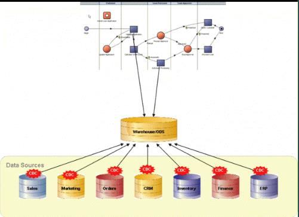

## 1.ODS ##
ODS（数据操作存储），是企业数据的抽取与交换平台。通常ODS的数据不做任何转化，只保留源系统数据。并将数据分发给数据仓库，数据集市等下游系统，并在ODS数据基础上开发各类报表。目前接触到的项目中，将数据仓库与ODS集成到一个项目中，共用同一个数据库。减少了数据传输，提高了资源的利用率。在ODS层数据中，我们将源系统数据变化的过程保留下来，由于源系统和ODS不在同一服务器上，源系统通常通过文件交换的方式传输数据，为了减少文件传输，数据文件可分为增量文件和全量文件。根据保留数据类型的不同，又分为流水数据与历史数据。通常我们在开发ODS时，涉及到以下几种算法，全量历史加载算法，增量历史加载算法，流水全量加载算法，流水增量加载算法，全量覆盖加载算法。

## 2.相关变量说明 ##

变量名 | 变量描述
---|---
${DB} | 数据库实例名
${TBNAME} | 表名
$COLS|表字段，以逗号分隔，col1,col2..
$DATA_DT|数据加载日期
${SRC_DB}|源数据库实例名
${SRC_TBNAME}|源表名
ND|临时表，用于加载当日数据
OD|临时表，用于加载上日数据
${HT_S_DT}|拉链开始日期
${HT_E_DT}|拉链结束日期
${TX_DATE}|交易日期，作业运行日期
WT_U|临时表，用于保存需要关链数据
WT_I|临时表，用于保存需要插入的数据

## 3.全量覆盖加载算法 ##
全量覆盖加载是所有加载中最简单的一种数据加载方式。它是指直接将目标表中数据删除并将源系统提供的数据文件直接加载到目标表中的过程。伪代码如下：
```
//清除表数据
TRUNCATE TABLE  ${DB}.${TBNAME} ;
//将源表数据插入到目标表中
INSERT INTO ${DB}.${TBNAME}
(    $COLS
    ,DATA_DT)
SELECT
     $COLS
    ,TO_DATE('$DATA_DT', 'YYYYMMDD')
FROM ${SRC_DB}.${SRC_TBNAME};
```
## 4.全量历史加载算法 ##
- 将当日数据加载到ND表中
```
INSERT INTO ${ND}( $COLS )
SELECT $COLS
FROM ${SRC_DB}.${SRC_TBNAME}
;
```
- 将上日正常数据加载到临时表OD中
```
INSERT INTO OD
SELECT * FROM ${DB}.${TBNAME}
WHERE ${HT_E_DT} > ${TX_DATE}   
AND   ${HT_S_DT} <= ${TX_DATE}
;
```
- 产生插入结果数据（新增数据，当日数据不在昨日数据中），并将数据加载到临时表WT_I中
```
INSERT INTO WT_I(
    $COLS
   ,${HT_S_DT}
   ,${HT_E_DT}
   ,DATA_DT )
SELECT
    $COLS
   ,$TX_DATE
   ,$MAX_DT
   ,$TX_DATE
FROM ${ND}
WHERE ($COLS_NOT_NULL)
  NOT IN (SELECT $COLS_NOT_NULL
          FROM OD)
;
```
- 产生关链数据(昨日数据不在当日数据中,已经被源系统删除的数据)，并将数据加在到临时表WT_U中
```
INSERT INTO WT_U(
     $COLS
    ,${HT_S_DT}
    ,${HT_E_DT}
    ,DATA_DT )
SELECT
     $COLS
    ,${HT_S_DT}
    ,${TX_DATE}
    ,DATA_DT
FROM OD
WHERE ( $COLS_NOT_NULL )
  NOT IN (SELECT $COLS_NOT_NULL
          FROM ${ND})
;
```
- 将目标表中已经失效的数据关链
```
UPDATE  ${DB}.${TBNAME}
SET     ${HT_E_DT} = ${TX_DATE}
WHERE   ($COLS_NOT_NULL) IN (SELECT $COLS_NOT_NULL FROM WT_U)
AND   ${HT_E_DT} > ${TX_DATE}   
AND   ${HT_S_DT} <= ${TX_DATE}
;
```
- 将新增数据插入插入到目标表中
```
INSERT INTO ${DB}.${TBNAME}(
     $COLS
    ,${HT_S_DT}
    ,${HT_E_DT}
    ,DATA_DT)
SELECT
     $COLS
    ,${HT_S_DT}
    ,${HT_E_DT}
    ,DATA_DT
FROM WT_I;
```
## 5.增量历史加载算法 ##
1.将当日数据加载到临时表ND表中
```
INSERT INTO ${ND}( $COLS )
SELECT $COLS
FROM ${DB}.${SRC_TBNAME}
;
```
- 将上日正常数据加载到临时表OD中(根据表主键查找当日数据)
```
INSERT INTO OD
SELECT * FROM ${DB}.${TBNAME}
WHERE ($PRI_KEY_NAME) IN (SELECT $PRI_KEY_NAME FROM ${ND})
AND ${HT_E_DT} > ${TX_DATE}   
AND ${HT_S_DT} <= ${TX_DATE}
```
- 产生插入结果数据（当日数据不在昨日数据中），并将数据加载到临时表WT_I中
```
INSERT INTO WT_I(
    $COLS
   ,${HT_S_DT}
   ,${HT_E_DT}
   ,DATA_DT )
SELECT
    $COLS
   ,$TX_DATE
   ,$MAX_DT
   ,$TX_DATE
FROM ${ND}
WHERE ($COLS_NOT_NULL)
  NOT IN (SELECT $COLS_NOT_NULL
          FROM OD)
;
```
- 产生关链数据(昨日数据不在当日数据中,源系统已经失效数据)，并将数据加在到临时表WT_U中
```
INSERT INTO WT_U(
     $COLS
    ,${HT_S_DT}
    ,${HT_E_DT}
    ,DATA_DT )
SELECT
     $COLS
    ,${HT_S_DT}
    ,${TX_DATE}
    ,DATA_DT
FROM OD
WHERE ( $COLS_NOT_NULL )
  NOT IN (SELECT $COLS_NOT_NULL
          FROM ${ND})
;
```
- 将目标表中失效的数据关链
```
UPDATE  ${DB}.${TBNAME}
SET     ${HT_E_DT} =${TX_DATE}
WHERE   ($COLS_NOT_NULL) IN (SELECT $COLS_NOT_NULL FROM WT_U)
AND ($PRI_KEY_NAME) IN (SELECT $PRI_KEY_NAME FROM ${ND})
AND ${HT_E_DT} > ${TX_DATE}   
AND ${HT_S_DT} <= ${TX_DATE}
;
```
- 插入当日新增数据
```
INSERT INTO ${DB}.${TBNAME}(
     $COLS
    ,${HT_S_DT}
    ,${HT_E_DT}
    ,DATA_DT)
SELECT
     $COLS
    ,${HT_S_DT}
    ,${HT_E_DT}
    ,DATA_DT
FROM WT_I;
```
## 6.流水增量加载算法 ##
- 清除当日数据
```
DELETE FROM ${DB}.${TBNAME}
WHERE DATA_DT = '$DATA_DT'
;
```
- 插入数据
```
INSERT INTO ${DB}.${TBNAME}
(    $COLS
    ,DATA_DT)
SELECT
     $COLS
    ,'$DATA_DT'
FROM ${DB}.${SRC_TBNAME}
MINUS ALL
SELECT
     $COLS
    ,'$DATA_DT'
FROM ${DB}.${TBNAME}
WHERE DATA_DT <= ${TX_DATE}
;
```
## 7.流水全量加载算法 ##
- 清除当日数据
```
DELETE FROM ${DB}.${TBNAME}
WHERE DATA_DT = $DATA_DT
```
- 插入数据
```
INSERT INTO ${DB}.${TBNAME}
(    $COLS
    ,DATA_DT
    ,HT_S_DT
    ,HT_E_DT
    )
SELECT
     $COLS
    ,'$DATA_DT'
    ,'$DATA_DT'
    ,'$MAX_DT'
FROM ${DB}.${SRC_TBNAME};
```
