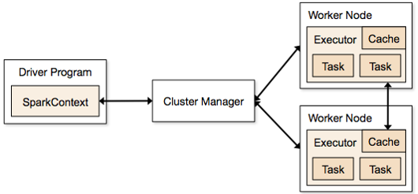
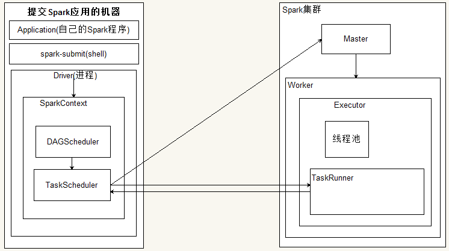

Spark是一种开源的分布式并行计算框架，Spark拥有Hadoop Mapreduce计算框架的优点。但是与Hadoop Mapreduce最大的不同就是：Hadoop Mapreduce分为两个阶段，map 和 reduce，两个阶段完了，就完了，在一个作业里能做的事情很少。而Spark是基于内存迭代计算的，可以分为N个阶段，一个阶段完了可以继续下一阶段的处理，而且Spark作业的中间结果可以保存到内存中，不用再频繁去HDFS或其它数据源读取数据。
<!-- more -->
## 1. Spark术语 ##
Spark框架图如下：

- Cluster Manager：资源管理，在集群上获取资源的外部服务，目前主要有三种，Spark原生的资源管理Standalone,mesos,hadoop yarn
- Application：用户编写的应用程序
- Driver：应用程序中运行的main函数并创建SparkContext。创建的SparkContext负责与Cluster Manager通信，进行资源的申请，任务的分配与监控，SparkContext代表Driver
- Worker：集群中可以运行应用程序的节点
- Executor：应用程序在Worker的进程，负责执行task
- Task:被Executor执行的工作单元，是运行Application最小的单位，多个task组合成一个stage，Task的调度和管理由TaskScheduler负责
- Job：包含多个Task组成的并行计算
- Stage：Stage：每个Job的Task被拆分成很多组Task, 作为一个TaskSet，命名为Stage。Stage的调度和划分由DAGScheduler负责。Stage又分为Shuffle Map Stage和Result Stage两种。Stage的边界就在发生Shuffle的地方。
- RDD：Spark的基本数据操作抽象，可以通过一系列算子进行操作。RDD是Spark最核心的东西，可以被分区、被序列化、不可变、有容错机制，并且能并行操作的数据集合。存储级别可以是内存，也可以是磁盘。
- DAGScheduler：根据Job构建基于Stage的DAG（有向无环任务图），并提交Stage给TaskScheduler
- TaskScheduler：将Stage提交给Worker（集群）运行，每个Executor运行什么在此分配。
- 共享变量：Application在整个运行过程中，可能需要一些变量在每个Task中都使用，共享变量用于实现该目的。Spark有两种共享变量：一种缓存到各个节点的广播变量；一种只支持加法操作，实现求和的累加变量。
- 宽依赖：或称为ShuffleDependency, 宽依赖需要计算好所有父RDD对应分区的数据，然后在节点之间进行Shuffle。
- 窄依赖：或称为NarrowDependency，指某个RDD，其分区partition x最多被其子RDD的一个分区partion y依赖。窄依赖都是Map任务，不需要发生shuffle。因此，窄依赖的Task一般都会被合成在一起，构成一个Stage。
## 2.Spark工作流程图 ##

- spark-submit 提交了应用程序的时候，提交spark应用的机器会通过反射的方式，创建和构造一个Driver进程，Driver进程执行Application程序，
- Driver根据sparkConf中的配置初始化SparkContext,在SparkContext初始化的过程中会启动DAGScheduler和taskScheduler
- taskSheduler通过后台进程，向Master注册Application，Master接到了Application的注册请求之后，会使用自己的资源调度算法，在spark集群的worker上，通知worker为application启动多个Executor。
- Executor会向taskScheduler反向注册。
- Driver完成SparkContext初始化
- application程序执行到Action时，就会创建Job。并且由DAGScheduler将Job划分多个Stage,每个Stage 由TaskSet 组成
- DAGScheduler将TaskSet提交给taskScheduler
- taskScheduler把TaskSet中的task依次提交给Executor
- Executor在接收到task之后，会使用taskRunner来封装task（TaskRuner主要将我们编写程序，也就是我们编写的算子和函数进行拷贝和反序列化）,然后，从Executor的线程池中取出一个线程来执行task。就这样Spark的每个Stage被作为TaskSet提交给Executor执行，每个Task对应一个RDD的partition,执行我们的定义的算子和函数。直到所有操作执行完为止。

## 3.RDD ##
- RDD是Spark提供的核心抽象，全称为Resillient Distributed Dataset，即弹性分布式数据集
- RDD在抽象上来说是一种元素集合，包含了数据。它是被分区的，分为多个分区，每个分区分布在集群中的不同节点上，从而让RDD中的数据可以被并行操作。
- RDD通常通过Hadoop上的文件，即HDFS文件或者Hive表，来进行创建；有时也可以通过应用程序中的集合来创建。
- RDD最重要的特性就是，提供了容错性，可以自动从节点失败中恢复过来。即如果某个节点上的RDD partition，因为节点故障，导致数据丢了，那么RDD会自动通过自己的数据来源重新计算该partition。这一切对使用者是透明
- RDD的数据默认情况下存放在内存中的，但是在内存资源不足时，Spark会自动将RDD数据写入磁盘
