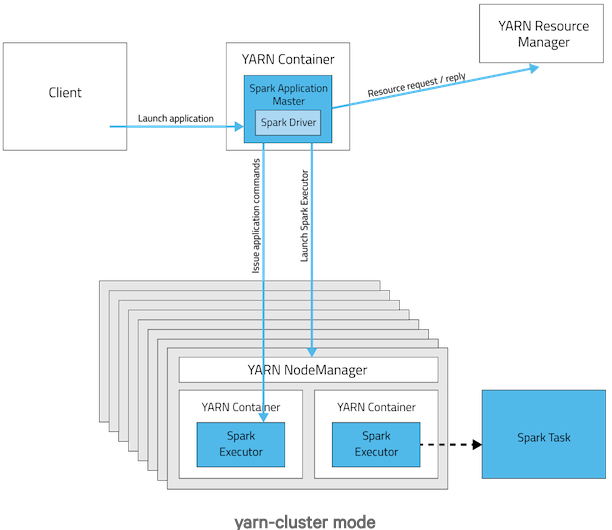

在Spark中，有Yarn-Client和Yarn-Cluster两种模式可以运行在Yarn上，通常情况下Yarn-cluster适用于生产环境，而Yarn-Cluster更适用于交互，调试模式，以下是它们的区别
<!-- more -->
## 1.Spark插拨式资源管理 ##
Spark支持可插拔的集群管理模式(Standalone、Mesos以及YARN )，集群管理负责启动executor进程，编写Spark application 的人根本不需要知道Spark用的是什么集群管理。Spark支持的三种集群模式，这三种集群模式都由两个组件组成:master和slave。Master服务(YARN ResourceManager,Mesos master和Spark standalone master)决定哪些application可以运行，什么时候运行以及哪里去运行。而slave服务( YARN NodeManager, Mesos slave和Spark standalone slave)实际上运行executor进程。当在YARN上运行Spark作业，每个Spark executor作为一个YARN容器(Container)运行。Spark可以使得多个Tasks在同一个容器(container)里面运行，极大地节省了任务的启动时间。这是个很大的优点。

## 2.Spark On Yarn的优势 ##
1. Spark支持资源动态共享，运行于Yarn的框架都共享一个集中配置好的资源池
2. 可以很方便的利用Yarn的资源调度特性来做分类·，隔离以及优先级控制负载，拥有更灵活的调度策略
3. Yarn可以自由地选择executor数量
4. Yarn是唯一支持Spark安全的集群管理器，使用Yarn，Spark可以运行于Kerberized Hadoop之上，在它们进程之间进行安全认证

## 3.Appliaction Master ##
在Yarn中，每个application都有一个Application Master进程，它是Appliaction启动的第一个容器，它负责从ResourceManager中申请资源，分配资源，同时通知NodeManager来为Application启动container，Application Master避免了需要一个活动的client来维持，启动Applicatin的client可以随时退出，而由Yarn管理的进程继续在集群中运行

## 4.Yarn-cluster ##
在Yarn-cluster模式下，driver运行在Appliaction Master上，Appliaction Master进程同时负责驱动Application和从Yarn中申请资源，该进程运行在Yarn container内，所以启动Application Master的client可以立即关闭而不必持续到Application的生命周期:

1. 客户端生成作业信息提交给ResourceManager(RM)
2. RM在某一个NodeManager(由Yarn决定)启动container并将Application Master(AM)分配给该NodeManager(NM)
3. NM接收到RM的分配，启动Application Master并初始化作业，此时这个NM就称为Driver
4. Application向RM申请资源，分配资源同时通知其他NodeManager启动相应的Executor
5. Executor向NM上的Application Master注册汇报并完成相应的任务
## 5.Yarn-client ##
Application Master仅仅从Yarn中申请资源给Executor，之后client会跟container通信进行作业的调度

1. 客户端生成作业信息提交给ResourceManager(RM)
2. RM在本地NodeManager启动container并将Application Master(AM)分配给该NodeManager(NM)
3. NM接收到RM的分配，启动Application Master并初始化作业，此时这个NM就称为Driver
4. Application向RM申请资源，分配资源同时通知其他NodeManager启动相应的Executor
5. Executor向本地启动的Application Master注册汇报并完成相应的任务
