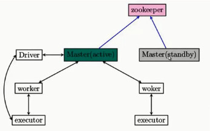

在Spark集群上安装Zookeeper,实现集群的高可用性（HA），Hadoop及Spark集群的搭建请参考相关博客。  
  

<!-- more -->
## 1.下载软件并解压 ##
```
mv zookeeper-3.4.6.tar.gz /home/yangql/app
tar -xvf zookeeper-3.4.6.tar.gz
```

## 2.设置环境变量 ##
编辑 .bash_profile文件,增加一下内容
```
export ZOOKEEPER_HOME=/home/yangql/app/zookeeper-3.4.6
export PATH=$PATH:$ZOOKEEPER_HOME/bin
```
## 3.配置zoo.cfg文件 ##
配置文件存放在$ZOOKEEPER_HOME/conf/目录下，将zoo_sample.cfd文件名称改为zoo.cfg。
配置说明：  
- tickTime：这个时间是作为 Zookeeper 服务器之间或客户端与服务器之间维持心跳的时间间隔，也就是每个 tickTime 时间就会发送一个心跳。  
- dataDir：顾名思义就是 Zookeeper 保存数据的目录，默认情况下，Zookeeper 将写数据的日志文件也保存在这个目录里。  
- clientPort：这个端口就是客户端连接 Zookeeper 服务器的端口，Zookeeper 会监听这个端口，接受客户端的访问请求。  
- 新建两个目录
```
 mkdir /home/yangql/app/zookeeper-3.4.6/data
 mkdir /home/yangql/app/zookeeper-3.4.6/log
 ```
- zoo.cfg配置文件内容
 ```
dataDir=/home/yangql/app/zookeeper-3.4.6/data
dataLogDir=/home/yangql/app/zookeeper-3.4.6/data
server.0=hadoop01:2888:3888
server.1=hadoop02:2888:3888
 ```
- 创建文件myid
 在目录/home/yangql/app/zookeeper-3.4.6/data目录下创建一个文件：myid
 ```
 touch /home/yangql/app/zookeeper-3.4.6/data/myid
 echo "0" > myid
 ```

## 4.同步到其它机器 ##
- 同步
 ```
scp -r zookeeper-3.4.6/ yangql@hadoop02:/home/yangql/app
scp .bash_profile yangql@hadoop02:/home/yangql
 ```
- 修改myid
```
echo 1 > myid
```

## 5.验证zookeeper ##
```
yangql@hadoop02 bin]$ zkServer.sh start
JMX enabled by default
Using config: /home/yangql/app/zookeeper-3.4.6/bin/../conf/zoo.cfg
Starting zookeeper ... STARTED
[yangql@hadoop02 bin]$ jps
1405 QuorumPeerMain
1423 Jps
[yangql@hadoop02 bin]$
```
## 6.在Spark集群上配置Zookeeper ##
- 配置 spark-env.sh
```
vim /home/yangql/app/spark-2.1.0-bin-hadoop2.7/conf/spark-env.sh
export SPARK_DAEMON_JAVA_OPTS="-Dsun.io.serialization.extendedDebugInfo=true -Dspark.deploy.recoveryMode=ZOOKEEPER -Dspark.deploy.zookeeper.url=hadoop01:2181,hadoop02:2181 -Dspark.deploy.zookeeper.dir=/spark"
```

## 7.验证 ##
- 进入Spark的Web管理页面：
http://192.168.1.231:8080/（Status: ALIVE）  
http://192.168.1.232:8080/（Status: STANDBY）

- 进入Spark bin目录执行 spark-shell,停止hadoop01 master 后
可以看到如下信息  
scala> 17/02/16 15:29:22 WARN client.StandaloneAppClient$ClientEndpoint: Connection to hadoop01:7077 failed; waiting for master to reconnect...
17/02/16 15:29:22 WARN cluster.StandaloneSchedulerBackend: Disconnected from Spark cluster! Waiting for reconnection...
17/02/16 15:29:22 WARN client.StandaloneAppClient$ClientEndpoint: Connection to hadoop01:7077 failed; waiting for master to reconnect...
