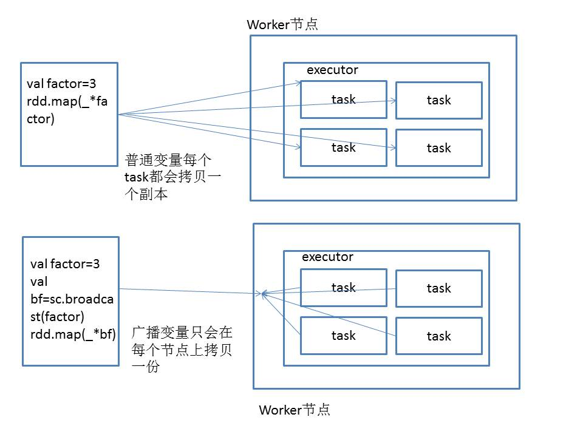

## 共享变量概念 ##
默认情况下，如果在一个算子中使用到了一个外部变量，那么这个变量值会被拷贝到每个task任务中。此时每个task都只能操作自己的那份变量副本。如果多个task想要共享变量，这种情况是做不到的。  
Spark为此提供了两种共享变量，一种是BroadCast Variable(广播变量)，另一种是Accumulator（累加变量）。BroadCast会将使用到的变量，仅仅为每个节点拷贝一份，而不是为每个task拷贝一个副本，这样做的好处是优化性能，减少网络传输以及内存消耗。`SparkContext.broadCast()`方法创建广播变量。用`value()`方法读取值。Accumulator则可以让多个task共同操作一个变量，变量可以进行累加操作
<!-- more -->
## 共享变量原理 ##

## 广播变量实例 ##
```
package com.spark.core

import org.apache.spark.SparkConf
import org.apache.spark.SparkContext

object BroadCastVariable{
  def main(args: Array[String]): Unit = {
   val conf = new SparkConf()
  .setMaster("local")
  .setAppName("BroadCastVariable")

  val sc = new SparkContext(conf)

  //创建一个共享变量-广播变量 只读，不能写
  val factor:Int=3
  val broadCastFactor=sc.broadcast(factor)

  //定义一个RDD
  val numberArray=Array(1,2,3,4)
  val numbers=sc.parallelize(numberArray, 2)
  val multiNumbers=numbers.map(_*broadCastFactor.value)
  multiNumbers.foreach(println)
  }

}
```
## 累加器实例 ##
```
package com.spark.core

import org.apache.spark.SparkContext
import org.apache.spark.SparkConf

object AccumulatorVariable {
  def main(args: Array[String]): Unit = {
    val conf = new SparkConf()
  .setMaster("local")
  .setAppName("BroadCastVariable")

  val sc = new SparkContext(conf)


   //定义一个共享变量-accumulator
  val sum=sc.accumulator(0)

  //定义一个RDD
  val numberArray=Array(1,2,3,4)
  val numbers=sc.parallelize(numberArray, 2)
   numbers.foreach(num=>sum+=num)
   println(sum)
  }
}
```
## 自定义广播变量 ##
自定义广播变量时，需要实现 Trait AccumulatorParam[T]中的三个方法，`zero`,`addAccumulator`,`addInPlace`,在调用时采用`val sessionAggrStatAccumulator=sc.accumulator("")(new SessionAggrStatAccumulator)`
实例：
```
package com.project.session

import org.apache.spark.AccumulatorParam
import com.project.dao.Constants
import com.project.util.StringUtils

/**
 * session聚合统计Accumulator
 */
class SessionAggrStatAccumulator extends AccumulatorParam[String]{
  /**
   * 用于对数据的初始化
   */
  override def zero(initialValue:String):String={
         Constants.SESSION_COUNT + "=0|"  +
				 Constants.TIME_PERIOD_1s_3s + "=0|" +
				 Constants.TIME_PERIOD_4s_6s + "=0|"  +
				 Constants.TIME_PERIOD_7s_9s + "=0|" +
				 Constants.TIME_PERIOD_10s_30s + "=0|" +
				 Constants.TIME_PERIOD_30s_60s + "=0|" +
				 Constants.TIME_PERIOD_1m_3m + "=0|" +
				 Constants.TIME_PERIOD_3m_10m + "=0|" +
				 Constants.TIME_PERIOD_10m_30m + "=0|" +
				 Constants.TIME_PERIOD_30m + "=0|" +
				 Constants.STEP_PERIOD_1_3 + "=0|" +
				 Constants.STEP_PERIOD_4_6 + "=0|" +
				 Constants.STEP_PERIOD_7_9 + "=0|" +
				 Constants.STEP_PERIOD_10_30 + "=0|" +
				 Constants.STEP_PERIOD_30_60 + "=0|" +
				 Constants.STEP_PERIOD_60 + "=0"
  }

  override def addAccumulator(v1:String, v2:String):String={
    add(v1,v2)
  }

  override def addInPlace(v1:String, v2:String):String={
    add(v1,v2)
  }

  /**
   * session统计计算逻辑
   * v1:连接字符串
   * V2范围区间
   * 返回更新后的字符串
   */
  private[this] def add(v1:String,v2:String):String={
    // 校验：v1为空的话，直接返回v2
    if(StringUtils.isEmpty(v1)){
      return v2
    }
    // 使用StringUtils工具类，从v1中，提取v2对应的值，并累加1
		val oldValue = StringUtils.getFieldFromConcatString(v1, "\\|", v2);
		if(oldValue != null) {
			// 将范围区间原有的值，累加1
			val newValue = oldValue.toInt + 1;
			// 使用StringUtils工具类，将v1中，v2对应的值，设置成新的累加后的值
			return StringUtils.setFieldInConcatString(v1, "\\|", v2, newValue.toString());  
		}
    return v1
  }

}
```
