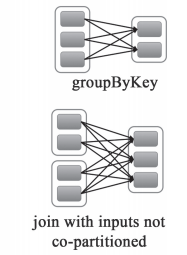

Spark中RDD的高效与DAG（有向无环图）有很大的关系，在DAG调度中需要对计算的过程划分Stage，划分的依据就是RDD之间的依赖关系。RDD之间的依赖关系分为两种，宽依赖(wide dependency/shuffle dependency)和窄依赖（narrow dependency）
<!-- more -->

## 1.窄依赖 ##
窄依赖就是指父RDD的每个分区只被一个子RDD分区使用，子RDD分区通常只对应常数个父RDD分区，如下图所示【其中每个小方块代表一个RDD Partition】  
  

窄依赖有分为两种：
- 一种是一对一的依赖，即OneToOneDependency
- 还有一个是范围的依赖，即RangeDependency，它仅仅被org.apache.spark.rdd.UnionRDD使用。UnionRDD是把多个RDD合成一个RDD，这些RDD是被拼接而成，即每个parent RDD的Partition的相对顺序不会变，只不过每个parent RDD在UnionRDD中的Partition的起始位置不同

## 2.宽依赖 ##
宽依赖就是指父RDD的每个分区都有可能被多个子RDD分区使用，子RDD分区通常对应父RDD所有分区，如下图所示【其中每个小方块代表一个RDD Partition】  

## 3.窄依赖与窄依赖比较 ##
- 宽依赖往往对应着shuffle操作，需要在运行的过程中将同一个RDD分区传入到不同的RDD分区中，中间可能涉及到多个节点之间数据的传输，而窄依赖的每个父RDD分区通常只会传入到另一个子RDD分区，通常在一个节点内完成。
- 当RDD分区丢失时，对于窄依赖来说，由于父RDD的一个分区只对应一个子RDD分区，这样只需要重新计算与子RDD分区对应的父RDD分区就行。这个计算对数据的利用是100%的
- 当RDD分区丢失时，对于宽依赖来说，重算的父RDD分区只有一部分数据是对应丢失的子RDD分区的，另一部分就造成了多余的计算。宽依赖中的子RDD分区通常来自多个父RDD分区，极端情况下，所有父RDD都有可能重新计算。如下图，par4丢失，则需要重新计算par1,par2,par3,产生了冗余数据par5  

## 4.宽依赖，窄依赖函数 ##
- 窄依赖的函数有：  
map, filter, union, join(父RDD是hash-partitioned ), mapPartitions, mapValues
- 宽依赖的函数有：  
groupByKey, join(父RDD不是hash-partitioned ), partitionBy
