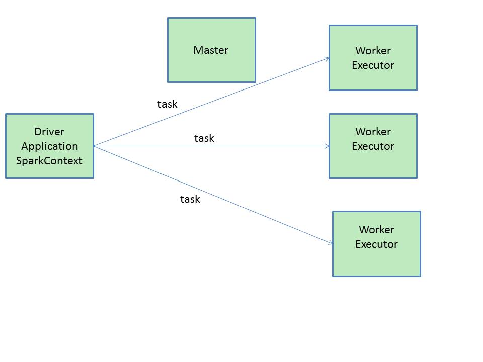

性能调优的第一要点是分配和增加更多的资源，在一定范围内，资源的增加和性能的提升，是成正比的。所以在写完一个Spark作业后，最优的资源配置是性能调优的第一步，在此基础上，当你能分配的资源达到最大，无法再分配更多的资源时，才去考虑其它性能调优的点，如共享变量，kyro序列化等。我们从需要分配那些资源、在哪里分配资源以及分配资源后性能为何会得到提升三个方面来讨论这个主题。
<!-- more -->
## 1. 需要分配的资源 ##
通常我们在完成一个Spark作业后，使用spark-submit命令提交作业，在spark-submit命令中，有一系列的参数可供我们配置，用于分配资源。通常我们提交作业的脚本如下：
```
./bin/spark-submit \
--class con.spark.core.WordCountCluster \
--num-executors 3 \  配置executor的数量
--driver-memory 1g \  配置driver的内存（影响不大）
--executor-memory 1g \  配置每个executor的内存大小
--executor-cores 3 \  配置每个executor的cpu core数量
/usr/local/SparkTest.jar \
```
从以上的命令我们可以看出，我们需要分配的资源有如下几个：
- executor
- cpu per executor
- memory per executor
- driver memory

## 2. 如何分配才能达到最佳 ##
对于Spark Standalone来说：比如你有20台机器，4G内存，2个CPU core。如果你有20个executor，那么每个executor能使用的内存为2G，每个executor能使用2个CPU core。  
对于Yarn资源队列。我们需要去查看我们要提交到的资源队列，还有多少资源可供我们使用。如资源队列有500G内存，100个CPU core。那如果我们有50个executor，那每个executor能使用的内存就只有10G，2个CPU   
资源分配总的原则就是：能使用的资源有多大，就尽量去调节到最大的大小。

## 3.资源为什么会影响性能 ##
在Driver上提交一个作业后，SparkContext，DAGScheduler，TaskScheduler会将我们的算子，切割成大量的task，提交到worker上的executor上面去执行。

- 增加executor
如果executor数量比较少，那么，能够并行执行的task数量就比较少，就意味着，我们的Application的并行执行的能力就很弱。比如有3个executor，每个executor有2个cpu core，那么同时能够并行执行的task，就是6个。6个执行完以后，再换下一批6个task。增加了executor数量以后，那么，就意味着，能够并行执行的task数量，也就变多了。比如原先是6个，现在可能可以并行执行10个，甚至20个，100个。那么并行能力就比之前提升了数倍，数十倍。相应的，性能（执行的速度），也能提升数倍~数十倍。
- 增加每个executor的cpu core
增加每个executor的cpu core就是增加了执行的并行能力。原本20个executor，每个才2个cpu core。能够并行执行的task数量，就是40个task。加到了5个。能够并行执行的task数量，就是100个task。执行的速度，提升了2.5倍。
- 增加每个executor的内存量   
第一：如果需要对RDD进行cache，那么更多的内存，就可以缓存更多的数据，将更少的数据写入磁盘，甚至不写入磁盘。减少了磁盘IO。   
第二：对于shuffle操作，reduce端，会需要内存来存放拉取的数据并进行聚合。如果内存不够，也会写入磁盘。如果给executor分配更多内存以后，就有更少的数据，需要写入磁盘，甚至不需要写入磁盘。减少了磁盘IO，提升了性能。  
第三：对于task的执行，可能会创建很多对象。如果内存比较小，就会导致JVM频繁的进行垃圾回收(GC),导致性能变慢。
