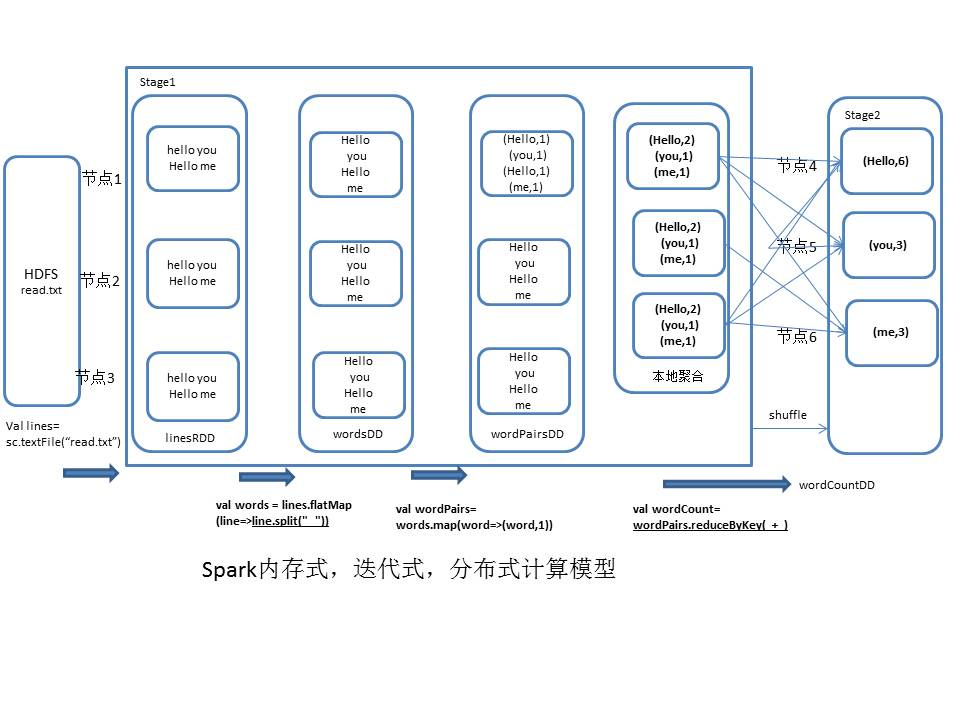

## 1.第一步 ##
创建SparkConf对象，设置Spark应用的配置信息，使用setMaster()可以设置Spark应用程序要连接的Spark集群的master节点的url，如果设置为"local"则代表在本地运行。
## 2.第二步 ##
创建SparkContext，在Spark中，SparkContext是Spark所有功能的一个入口，你无论是用java、scala，甚至是python编写，都必须要有一个SparkContext，它的主要作用，包括初始化Spark应用程序所需的一些核心组件，包括调度器（DAGSchedule、TaskScheduler），还会去到Spark Master节点上进行注册等等。在Spark中，编写不同类型的Spark应用程序，使用的SparkContext是不同的，如果使用scala，使用的就是原生的SparkContext对象,如果使用Java，那么就是JavaSparkContext对象,如果是开发Spark SQL程序，那么就是SQLContext、HiveContext.
<!-- more -->
## 3.第三步 ##
创建RDD，要针对输入源（hdfs文件、本地文件），创建一个初始的RDD，输入源中的数据会打散，分配到RDD的每个partition中，从而形成一个初始的分布式的数据集，SparkContext中，用于根据文件类型的输入源创建RDD的方法，叫做textFile()方法，在Java中，创建的普通RDD，都叫做JavaRDD，RDD中，有元素这种概念，如果是hdfs或者本地文件呢，创建的RDD，每一个元素就相当于
是文件里的一行。
## 4.第四步 ##
对初始RDD进行transformation操作，也就是一些计算操作，通常操作会通过创建function，并配合RDD的map、flatMap等算子来执行。如果比较简单，则创建指定Function的匿名内部类，如果function比较复杂，则会单独创建一个类，作为实现这个function接口的类
## 5.第五步 ##
使用action操作的，来触发程序的执行。
## 6.实现代码 ##
```
package com.spark.core

import org.apache.spark.SparkConf
import org.apache.spark.SparkConf
import org.apache.spark.SparkContext


object WordCount {
  def main(args: Array[String]): Unit = {
    //1.create sparkConf
    val conf = new SparkConf()
            //.setMaster("local")
            .setAppName("WordCount")
    //2.create sparkContext
    val sc = new SparkContext(conf)

    //3.create a rdd
    //val fileName="E:\\spark-scala-study\\spark-scala-study\\resouce\\README.md"
    val fileName="hdfs://hadoop01:9000/spark-study/README.md"
    val lines=sc.textFile(fileName)
    //每一行拆分成单个的单词
    val words = lines.flatMap(line=>line.split(" "))
    //将每一个单词，映射为(单词, 1)的这种格式
    val wordPairs=words.map(word=>(word,1))
    //单词作为key，统计每个单词出现的次数
    val wordCount=wordPairs.reduceByKey(_+_)
    wordCount.foreach(wordCount=>println(wordCount._1 + " appear " + wordCount._2 + " times"))
  }
}
```
## 7.原理图 ##

