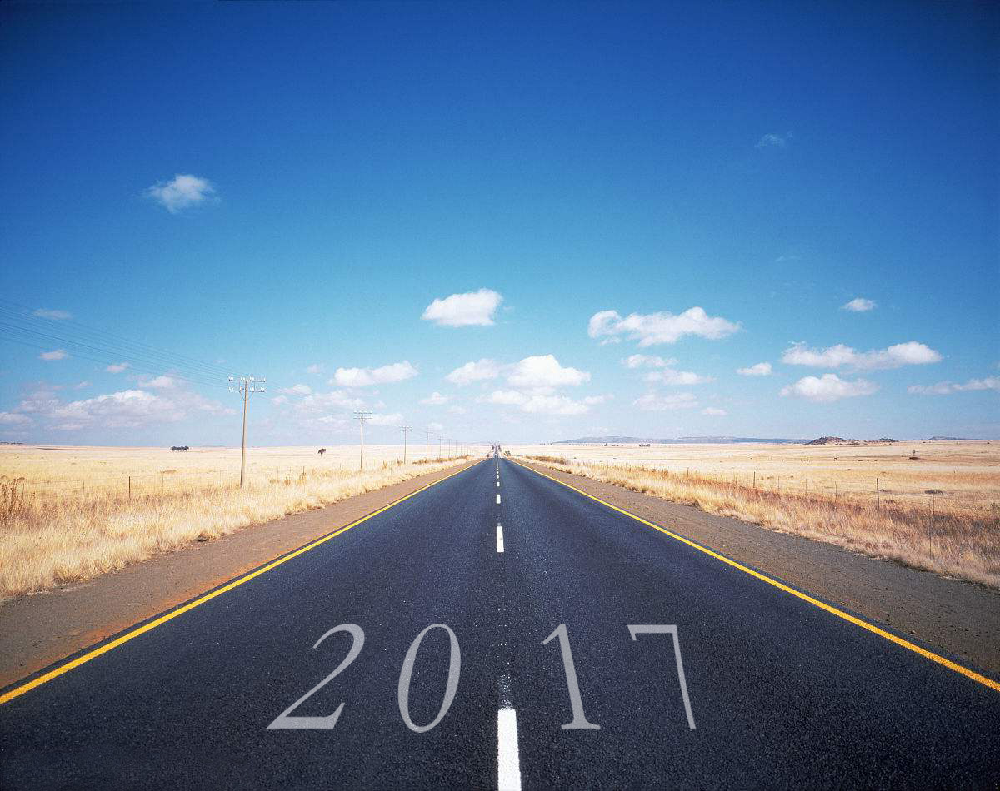

2017在路上

<!-- more -->
## 读书 ##
---
本月阅读基本荒废：
思考了自己本月读书少以及没有坚持下去的原因：
1.最近带孩子，还没有找到一个平衡点。
2.上下班通勤没有读书，白白浪费了时间。此后还是基于kindle阅读比较好点。
3.大前研一《思考的技术》，读了大概一半左右。随时随地保持思考，不盲目做事情，多问为什么。
4.《数据挖掘导论》，看到一半实在看不下去，虽然看了一半，但是自己吸收的很少，这本书适合有基础的人读。书虽然是好书，但是对于数学基础不扎实的我来说，读完，吸收完比较困难。
5.李航《统计学习基础》，看了第一章，没看下去。

计划下月完成5本：
1.大前研一《思考的技术》
2.《数据仓库基础》
3.蒙田随笔
4.偷书贼
5.优雅的老去

## 工作 ##
---
本月工作比较轻松，了解的数据仓库的ODS算法，PDM算法，ODS开发过程，PDM开发过程。总体来说，比较轻松。下月计划了解数据仓库建模以及源系统模型映射。
本月，对自己工作想了很多。按照目前的状态，一直做开发并不是自己最佳的选择，所以决定，往数据分析方向转型。

## 运动 ##
---
这个月运动基本废了，下月重启跑步计划，每周三次夜跑

## 总结 ##
---
对自己本月的状态比较不满意，下月得很努力才行，人生总有些东西需要坚持才行。
