## 第一章 安装Git工具 ##
下载GitHub for Windows,直接点击安装，安装完成后，可以看到“Git Shell”和“GitHub”，"Git Shell"用于命令行模式，“GitHub”桌面版。下面介绍一些常用命令：
### 1. 本地使用 ###
<!-- more -->
|行为|命令|备注|
|-|-|-|-|
|初始化|	init|	在本地的当前目录里初始化git仓库|
|初始化	|clone 地址	|从网络上某个地址拷贝仓库(repository)到本地|
|查看当前状态|status	|查看当前仓库的状态。碰到问题不知道怎么办的时候，可以通过看它给出的提示来解决问题|
|查看不同|diff|查看当前状态和最新的commit之间不同的地方|
|	|diff 版本号1 版本号2|	查看两个指定的版本之间不同的地方。这里的版本号指的是commit的hash值
|添加文件	|add -A	|这算是相当通用的了。在commit之前要先add|
|撤回stage的东西|checkout --.|这里用小数点表示撤回所有修改，在--的前后都有空格|
|提交|commit -m "提交信息"|提交信息最好能体现更改了什么|
|删除未tracked|	clean -xf|	删除当前目录下所有没有track过的文件。不管它是否是.gitignore文件里面指定的文件夹和文件|
|查看提交记录|log|查看当前版本及之前的commit记录|
|	|reflog|HEAD的变更记录|
|版本回退|reset --hard 版本号|	回退到指定版本号的版本，该版本之后的修改都被删除。同时也是通过这个命令回到最新版本。需要reflog配合|

### 2. 远程使用 ###

|行为	|命令|	备注|
|-|-|-|-|
|设置用户名|config --global user.name "你的用户名"||
|设置邮箱|config --global user.email "你的邮箱"||
|生成ssh key|ssh-keygen -t rsa -C "你的邮箱"|这条命令前面不用加git|
|添加远程仓库|remote add origin 你复制的地址|设置origin|
|上传并指定默认|	push -u origin master|	指定origin为默认主机，以后push默认上传到origin上|
|提交到远程仓库|push|将当前分支增加的commit提交到远程仓库|
|从远程仓库同步|pull|	在本地版本低于远程仓库版本的时候，获取远程仓库的commit|

可以用一张图直观地看出以上主要的命令对仓库的影响
(图片引用自：Git introduction for CVS/SVN/TFS users)


- workspace 即工作区，逻辑上是本地计算机，还没添加到repository的状态；
- staging 即版本库中的stage，是暂存区。修改已经添加进repository，但还没有作为commit提交，类似于缓存；
- Local repository 即版本库中master那个地方。到这一步才算是成功生成一个新版本；
- Remote repository 则是远程仓库。用来将本地仓库上传到网络，可以用于备份、共享、合作。本文将使用Github作为远程仓库的例子。

### 3. Git for Windows软件安装 ###
官网上并没有找到离线的安装包，在百度云上找到一个离线安装包，[下载地址](http://baidu.com) 密码： ，安装的时候一路点击`Next`就行了,安装完成后在桌面会看到两个图标，“GitHub” , "Git Shell" 。GitHub是桌面端工具，此处不做介绍。用Git Shell介绍相关命令的使用。

- 运行 `git init`来初始化仓库,它会创建一个隐藏的文件夹 `.git`
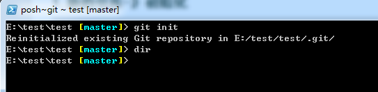
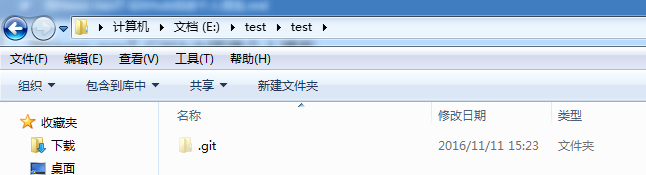
- 在当前仓库创建一个文件 readme.txt
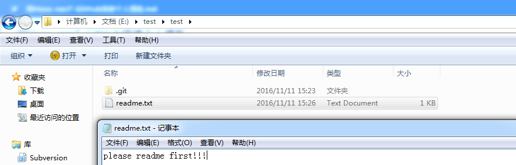
- `git status` 命令查看变化信息(它告诉我有一个还未追踪的文件，并提示我可以使用 `git add <file>...` 把它加进去。)
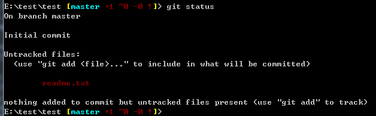
- `git add -A` 命令将未追踪的文件加进去
- 再次使用 `git status ` 查看变化信息（状态变了，说明添加成功。再看看它的提示 `Changes to be committed` ，也就是说现在可以执行commit了。）
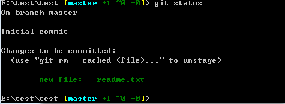
- 执行命令`git commit -m "提交信息"`将文件提交到repository里。提交信息用英文的双引号括起来。
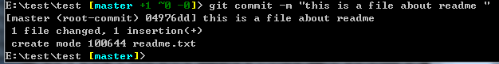
- 执行命令`git log` 就可以看到提交记录了
 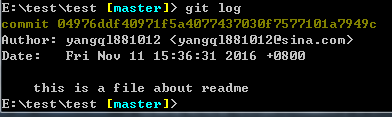
- 文件修改，修改readme.txt 文件内容，并使用命令`git status` 查看状态(比较一下就会看到，之前的是添加新文件，当时文件还没被追踪（untracked），而这次是更改已经追踪（tracked）的文件。)
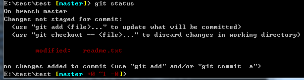
- 执行命令`git diff`查看文件做了那些变化,它默认跟最新的一个commit进行比较。
红色（前面有减号`-`）表示删除，绿色（前面有加号`+`）表示添加。
因此，在git看来，我们是删除了原来那一行，并添加了新的两行。这在文件内容特别多的时候效果比较明显。
这个命令在以下情况可以使用：你忘记改了什么，又想知道别人发给你新版本，你想知道更改了什么)

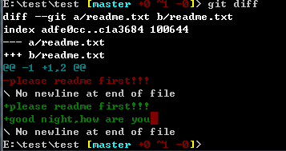

- 执行命令`git checkout -- .`撤销这些更改,并用`git status` 查看状态
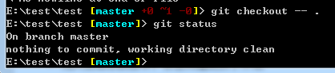
- 再次修改，并提交使用`git add -A` 与 `git commit -m "新增内容"`，并用`git log` 查看日志（现在有两个提交，我们看到两行黄色部分是以 commit 开头的，后面接着一串字符。这一串字符是16进制的数，是一串哈希值，这就是版本号）
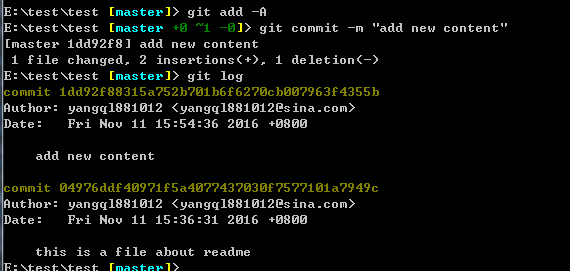
- 版本回退，执行 `git reset --hard 04976dd` （取版本号前7位就可以了）：
- 清除未追踪的文件
通常在reset或者pull之前要做两件事,1.将新添加且未追踪的文件删除掉，2.已追踪的文件已有修改，但又不需要这些修改，则将它们还原。
执行命令`git clean -xf` 清除untracked文件
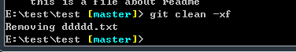

### 4.Github与Git的关联 ###
上面的操作都是在本地计算机上产生影响的，一般也够用了。如果你想和其他人分享你的代码，或者合作开发，可以用Github。
- 到Github注册账号。
- 本地配置用户名和邮箱，使用命令`git config --global user.name "你的用户名"`,`git config --global user.email "你的邮箱"
- 生成ssh key,执行命令`ssh-keygen -t rsa -C "你的邮箱"`,它会有三次等待你输入，直接回车即可。

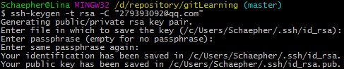
- 将生成的ssh key复制到剪贴板，执行 clip < ~/.ssh/id_rsa.pub （或者到上图提示的路径里去打开文件并复制）：
- 打开Github，进入Settings：
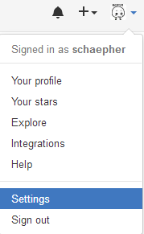
- 点击左边的 SSH and GPG keys ，将ssh key粘贴到右边的Key里面。Title随便命名即可
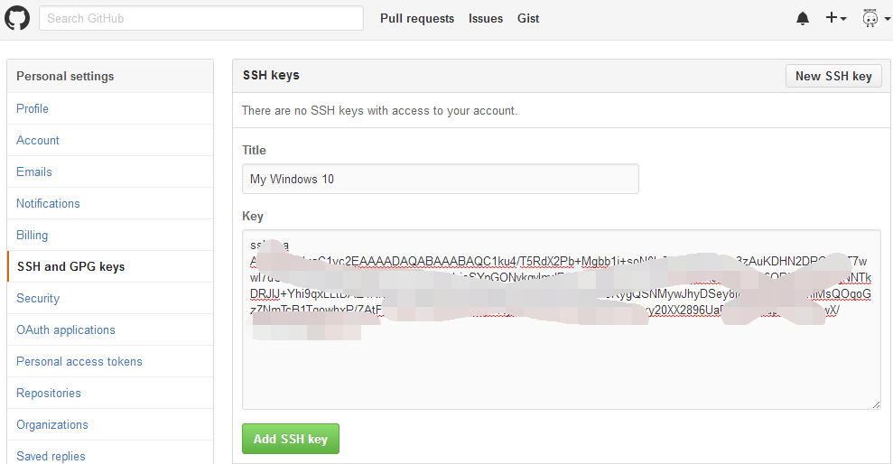
- 点击下面的 Add SSH key 就添加成功了。
- 执行 ssh -T git@github.com ：提示如下信息时，成功
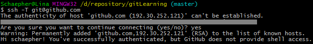
- 创建远程仓库

首先是在右上角点击进入创建界面：


接着输入远程仓库名：yangql881012.github.io
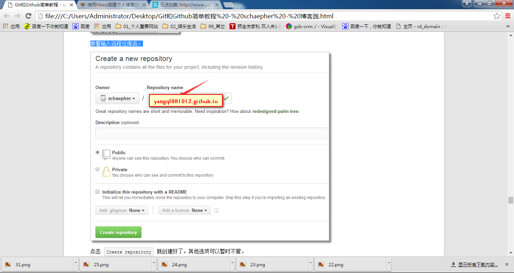
点击 Create repository 就创建好了
- 将远程仓库和本地仓库关联起来

先到Github上复制远程仓库的SSH地址
执行命令`git remote add origin 你复制的地址`

执行 `git push -u origin master` 将本地仓库上传至Github的仓库并进行关联

以后想在commit后同步到Github上，只要直接执行 git push 就行

## 第二章 Hexo安装与配置 ##
这篇教程是针对与Windows的。
### 1.安装Node.js ###
hexo是一款基于Node.js的静态博客框架,所以在安装Hexo之前得安装Node.js。官网上下载Node.js最新版本，我下载的版本是`node-v7.1.0-x64.msi`,一路`下一步`，安装完成后，重启电脑。
### 2.安装hexo ###
- 进入Git Bash,使用以下命令安装hexo($是提示符)
```
$ npm install hexo-cli -g
$ npm install hexo-deployer-git --save
$ hexo g
$ hexo d
```
如果网络很慢，可以执行以下命令
```
npm install -g cnpm --registry=https://registry.npm.taobao.orgc
cnpm install hexo-cli -g
```
### 3.创建博客目录 ###
接下来创建放置博客文件的文件夹：`yangql881012.github.io`文件夹。我hexo文件夹的位置为`E:\学习资料\97_github\yangql881012.github.io`，名字和地方可以自由选择。之后进入文件夹，即`E:\学习资料\97_github\yangql881012.github.io`内，点击鼠标右键，选择Git Bash，执行以下命令，Hexo会自动在该文件夹下下载搭建网站所需的所有文件。
```
$ hexo init
$ npm install
```
注：npm install 安装依赖包
执行以下命令，相看相应效果
```
$ hexo g
$ hexo s
```
然后用浏览器访问http://localhost:4000/，此时，你应该看到了一个漂亮的博客了。
### 4.部署本地文件到github ###
既然Repository已经创建了，当然是先把博客放到Github上去看看效果。编辑`E:\学习资料\97_github\yangql881012.github.io`下的_config.yml文件，建议使用Notepad++。
在_config.yml最下方，添加如下配置(命令中的第一个yangql881012为Github的用户名,第二个yangql881012.github.io为之前New的Repository的名字,记得改成自己的。另外记得一点，hexo的配置文件中任何’:’后面都是带一个空格的),如果配置以下命令出现ERROR Deployer not found : github，则参考上文的解决方法。
```
deploy:
  type: git
  repository: http://github.com/yangql881012/yangql881012.github.io.git
  branch: master
```
配置好_config.yml并保存后，执行以下命令部署到Github上。

```
$ hexo g
$ hexo d
```

此时，我们的博客已经搭建起来，并发布到Github上了，在浏览器访问yangql881012.github.io就能看到自己的博客了。
### 5.hexo的配置文件 ###
hexo里面有两个常用到的配置文件，分别是整个博客的配置文件`E:\学习资料\97_github\yangql881012.github.io\_config.yml`和主题的配置文件`E:\学习资料\97_github\yangql881012.github.io\themes\next\_config.yml`，此地址是对于我来说，hexo3.0使用的默认主题是landscape，因此你们的地址应该是`E:\学习资料\97_github\yangql881012.github.io\themes\landscape\_config.yml`，可在这两个文件里修改相应的配置信息。
- 博客配置文件 _config.yml

```# Hexo Configuration
## Docs: https://hexo.io/docs/configuration.html
## Source: https://github.com/hexojs/hexo/

# Site
title: 不圆的珠子
subtitle:
description:
author: 不圆的珠子
language: zh-Hans #设置语言
timezone:

# URL
## If your site is put in a subdirectory, set url as 'http://yoursite.com/child' and root as '/child/'
url: http://www.yangql.cn
root: /
permalink: :year/:month/:day/:title/
permalink_defaults:

# Directory
source_dir: source
public_dir: public
tag_dir: tags
archive_dir: archives
category_dir: categories
code_dir: downloads/code
i18n_dir: :lang
skip_render:

# Writing
new_post_name: :title.md # File name of new posts
default_layout: post
titlecase: false # Transform title into titlecase
external_link: true # Open external links in new tab
filename_case: 0
render_drafts: false
post_asset_folder: false
relative_link: false
future: true
highlight:
  enable: true
  line_number: true
  auto_detect: false
  tab_replace:

# Category & Tag
default_category: uncategorized
category_map:
tag_map:

# Date / Time format
## Hexo uses Moment.js to parse and display date
## You can customize the date format as defined in
## http://momentjs.com/docs/#/displaying/format/
date_format: YYYY-MM-DD
time_format: HH:mm:ss

# Pagination
## Set per_page to 0 to disable pagination
per_page: 10
pagination_dir: page

# Extensions
## Plugins: https://hexo.io/plugins/
## Themes: https://hexo.io/themes/
#theme: landscape
theme: next

feed:	#之后配置rss会用，使用如下配置即可
  type: atom
  path: atom.xml
  limit: 20  

# Deployment
## Docs: https://hexo.io/docs/deployment.html
deploy:
  type: git
  repository: http://github.com/yangql881012/yangql881012.github.io.git
  branch: master

avatar: /images/avatar.jpg
duoshuo_shortname: yangql881012

#添加搜索
search:
  path: search.xml
  field: post
  format: html
  limit: 10000
```

- 主题配置文件 _config.yml

```
# ---------------------------------------------------------------
# Site Information Settings
# ---------------------------------------------------------------

# Put your favicon.ico into `hexo-site/source/` directory.
favicon: /favicon.ico

# Set default keywords (Use a comma to separate)
keywords: "Hexo, NexT"

# Set rss to false to disable feed link.
# Leave rss as empty to use site's feed link.
# Set rss to specific value if you have burned your feed already.
rss:

# Specify the date when the site was setup
since: 2016  #网站时间 从xx开始 类似 1990-2016

# Canonical, set a canonical link tag in your hexo, you could use it for your SEO of blog.
# See: https://support.google.com/webmasters/answer/139066
# Tips: Before you open this tag, remeber set up your URL in hexo _config.yml ( ex. url: http://yourdomain.com )
canonical: true


# ---------------------------------------------------------------
# Menu Settings
# ---------------------------------------------------------------

# When running the site in a subdirectory (e.g. domain.tld/blog), remove the leading slash (/archives -> archives)
menu:
  home: /
  categories: /categories
  archives: /archives
  tags: /tags
  #schedule: /schedule
  about: /about
  #commonweal: /404.html


# Enable/Disable menu icons.
# Icon Mapping:
#   Map a menu item to a specific FontAwesome icon name.
#   Key is the name of menu item and value is the name of FontAwsome icon. Key is case-senstive.
#   When an question mask icon presenting up means that the item has no mapping icon.
menu_icons:
  enable: true
  #KeyMapsToMenuItemKey: NameOfTheIconFromFontAwesome
  home: home
  about: user
  categories: th
  schedule: calendar
  tags: tags
  archives: archive
  commonweal: heartbeat


# ---------------------------------------------------------------
# Scheme Settings
# ---------------------------------------------------------------

# Schemes
#scheme: Muse
#scheme: Mist
scheme: Pisces


# ---------------------------------------------------------------
# Font Settings
# - Find fonts on Google Fonts (https://www.google.com/fonts)
# - All fonts set here will have the following styles:
#     light, light italic, normal, normal intalic, bold, bold italic
# - Be aware that setting too much fonts will cause site running slowly
# - Introduce in 5.0.1
# ---------------------------------------------------------------
font:
  enable: true

  # Uri of fonts host. E.g. //fonts.googleapis.com (Default)
  host:

  # Global font settings used on <body> element.
  global:
    # external: true will load this font family from host.
    external: true
    family: Lato

  # Font settings for Headlines (h1, h2, h3, h4, h5, h6)
  # Fallback to `global` font settings.
  headings:
    external: true
    family:

  # Font settings for posts
  # Fallback to `global` font settings.
  posts:
    external: true
    family:

  # Font settings for Logo
  # Fallback to `global` font settings.
  # The `size` option use `px` as unit
  logo:
    external: true
    family:
    size:

  # Font settings for <code> and code blocks.
  codes:
    external: true
    family:
    size:


# ---------------------------------------------------------------
# Sidebar Settings
# ---------------------------------------------------------------


# Social Links
# Key is the link label showing to end users.
# Value is the target link (E.g. GitHub: https://github.com/iissnan)
#social:
  #LinkLabel: Link


# Social Links Icons
# Icon Mapping:
#   Map a menu item to a specific FontAwesome icon name.
#   Key is the name of the item and value is the name of FontAwsome icon. Key is case-senstive.
#   When an globe mask icon presenting up means that the item has no mapping icon.
social_icons:
  enable: true
  # Icon Mappings.
  # KeyMapsToSocalItemKey: NameOfTheIconFromFontAwesome
  GitHub: github
  Twitter: twitter
  Weibo: weibo


# Sidebar Avatar
# in theme directory(source/images): /images/avatar.jpg
# in site  directory(source/uploads): /uploads/avatar.jpg
#avatar:


# Table Of Contents in the Sidebar
toc:
  enable: true

  # Automatically add list number to toc.
  number: true


# Creative Commons 4.0 International License.
# http://creativecommons.org/
# Available: by | by-nc | by-nc-nd | by-nc-sa | by-nd | by-sa | zero
#creative_commons: by-nc-sa
#creative_commons:


sidebar:
  # Sidebar Position, available value: left | right
  #position: left
  position: right

  # Sidebar Display, available value:
  #  - post    expand on posts automatically. Default.
  #  - always  expand for all pages automatically
  #  - hide    expand only when click on the sidebar toggle icon.
  #  - remove  Totally remove sidebar including sidebar toggler.
  display: post
  #display: always
  #display: hide
  #display: remove


# Blogrolls
#links_title: Links
#links_layout: block
#links_layout: inline
#links:
  #Title: http://example.com/


# ---------------------------------------------------------------
# Misc Theme Settings
# ---------------------------------------------------------------

# Custom Logo.
# !!Only available for Default Scheme currently.
# Options:
#   enabled: [true/false] - Replace with specific image
#   image: url-of-image   - Images's url
custom_logo:
  enabled: false
  image:


# Code Highlight theme
# Available value:
#    normal | night | night eighties | night blue | night bright
# https://github.com/chriskempson/tomorrow-theme
highlight_theme: normal


# Automatically scroll page to section which is under <!-- more --> mark.
scroll_to_more: true


# Automatically Excerpt. Not recommand.
# Please use <!-- more --> in the post to control excerpt accurately.
auto_excerpt:
  enable: false
  length: 150


# Wechat Subscriber
#wechat_subscriber:
  #enabled: true
  #qcode: /path/to/your/wechatqcode ex. /uploads/wechat-qcode.jpg
  #description: ex. subscribe to my blog by scanning my public wechat account


# ---------------------------------------------------------------
# Third Party Services Settings
# ---------------------------------------------------------------

# MathJax Support
mathjax:
  enable: true
  cdn: //cdn.mathjax.org/mathjax/latest/MathJax.js?config=TeX-AMS-MML_HTMLorMML


# Swiftype Search API Key
#swiftype_key:

# Baidu Analytics ID
#baidu_analytics:

# Duoshuo ShortName
#duoshuo_shortname:

# Disqus
#disqus_shortname:

# Baidu Share
# Available value:
#    button | slide
# Warning: Baidu Share does not support https.
#baidushare:
##  type: button

# Share
#jiathis:
# Warning: JiaThis does not support https.
#add_this_id:

# Share
#duoshuo_share: true

# Google Webmaster tools verification setting
# See: https://www.google.com/webmasters/
#google_site_verification:


# Google Analytics
#google_analytics:

# CNZZ count
#cnzz_siteid:


# Make duoshuo show UA
# user_id must NOT be null when admin_enable is true!
# you can visit http://dev.duoshuo.com get duoshuo user id.
duoshuo_info:
  ua_enable: true
  admin_enable: false
  user_id: 0
  #admin_nickname: Author


# Facebook SDK Support.
# https://github.com/iissnan/hexo-theme-next/pull/410
facebook_sdk:
  enable: false
  app_id:       #<app_id>
  fb_admin:     #<user_id>
  like_button:  #true
  webmaster:    #true

# Facebook comments plugin
# This plugin depends on Facebook SDK.
# If facebook_sdk.enable is false, Facebook comments plugin is unavailable.
facebook_comments_plugin:
  enable: false
  num_of_posts: 10  # min posts num is 1
  width: 100%       # default width is 550px
  scheme: light     # default scheme is light (light or dark)


# Show number of visitors to each article.
# You can visit https://leancloud.cn get AppID and AppKey.
leancloud_visitors:
  enable: true
  app_id: #<app_id>
  app_key: #<app_key>

# Show PV/UV of the website/page with busuanzi.
# Get more information on http://ibruce.info/2015/04/04/busuanzi/
busuanzi_count:
  # count values only if the other configs are false
  enable: false
  # custom uv span for the whole site
  site_uv: true
  site_uv_header: <i class="fa fa-user"></i>
  site_uv_footer:
  # custom pv span for the whole site
  site_pv: true
  site_pv_header: <i class="fa fa-eye"></i>
  site_pv_footer:
  # custom pv span for one page only
  page_pv: true
  page_pv_header: <i class="fa fa-file-o"></i>
  page_pv_footer:

# Tencent analytics ID
# tencent_analytics:

# Enable baidu push so that the blog will push the url to baidu automatically which is very helpful for SEO
baidu_push: false

# Google Calendar
# Share your recent schedule to others via calendar page
#
# API Documentation:
# https://developers.google.com/google-apps/calendar/v3/reference/events/list
calendar:
  enable: false
  calendar_id: <required>
  api_key: <required>
  orderBy: startTime
  offsetMax: 24
  offsetMin: 4
  timeZone:
  showDeleted: false
  singleEvents: true
  maxResults: 250


#! ---------------------------------------------------------------
#! DO NOT EDIT THE FOLLOWING SETTINGS
#! UNLESS YOU KNOW WHAT YOU ARE DOING
#! ---------------------------------------------------------------

# Motion
use_motion: true

# Fancybox
fancybox: true


# Script Vendors.
# Set a CDN address for the vendor you want to customize.
# For example
#    jquery: https://ajax.googleapis.com/ajax/libs/jquery/2.2.0/jquery.min.js
# Be aware that you should use the same version as internal ones to avoid potential problems.
# Please use the https protocol of CDN files when you enable https on your site.
vendors:
  # Internal path prefix. Please do not edit it.
  _internal: lib

  # Internal version: 2.1.3
  jquery:

  # Internal version: 2.1.5
  # See: http://fancyapps.com/fancybox/
  fancybox:
  fancybox_css:

  # Internal version: 1.0.6
  # See: https://github.com/ftlabs/fastclick
  fastclick:

  # Internal version: 1.9.7
  # See: https://github.com/tuupola/jquery_lazyload
  lazyload:

  # Internal version: 1.2.1
  # See: http://VelocityJS.org
  velocity:

  # Internal version: 1.2.1
  # See: http://VelocityJS.org
  velocity_ui:

  # Internal version: 0.7.9
  # See: https://faisalman.github.io/ua-parser-js/
  ua_parser:

  # Internal version: 4.4.0
  # See: http://fontawesome.io/
  fontawesome:


# Assets
css: css
js: js
images: images

# Theme version
version: 5.0.2
```
### 6.发布一篇文章 ###
- 在Git Bash执行命令：$ hexo new "my new post"
- 在E:\yangql881012.github.io\source\_post中打开my-new-post.md，打开方式使用记事本或notepad++。
```
title: my new post #文章标题
date: 2016-11-12 22:56:29 #发表日期，一般不改动
categories: blog #文章文类
tags: [博客，文章] #文章标签，多于一项时用这种格式，只有一项时使用tags: blog
---
#这里是正文，用markdown写，你可以选择写一段显示在首页的简介后，加上
<!--more-->#在<!--more-->之前的内容会显示在首页，之后的内容会被隐藏，当游客点击Read more才能看到。
```
写完文章后，你可以使用以下命令：
- $ hexo g生成静态文件。
- $ hexo s在本地预览效果。
- hexo d同步到github
- 使用http://huangjunhui.github.io进行访问。

## 第3章 安装nexT ##
Hexo 安装主题的方式非常简单，只需要将主题文件拷贝至站点目录的 themes 目录下， 然后修改下配置文件即可。具体到 NexT 来说，安装步骤如下。
### 1.下载主题 ###
- 打开 Git Bash
- cd E:\学习资料\97_github\yangql881012.github.io
- git clone https://github.com/iissnan/hexo-theme-next themes/next
### 2.启用主题 ###
与所有 Hexo 主题启用的模式一样。 当 克隆/下载 完成后，打开 站点配置文件， 找到 theme 字段，并将其值更改为 next。
```
theme: next
```
到此，NexT 主题安装完成。下一步我们将验证主题是否正确启用。在切换主题之后、验证之前， 我们最好使用 hexo clean 来清除 Hexo 的缓存。
### 3.验证主题 ###
首先启动 Hexo 本地站点，并开启调试模式（即加上 --debug），整个命令是 hexo s --debug。 在服务启动的过程，注意观察命令行输出是否有任何异常信息，如果你碰到问题，这些信息将帮助他人更好的定位错误。 当命令行输出中提示出：
INFO  Hexo is running at http://0.0.0.0:4000/. Press Ctrl+C to stop.
此时即可使用浏览器访问 http://localhost:4000，检查站点是否正确运行。
### 4.主题设定 ###
Scheme 是 NexT 提供的一种特性，借助于 Scheme，NexT 为你提供多种不同的外观。同时，几乎所有的配置都可以 在 Scheme 之间共用。目前 NexT 支持三种 Scheme，他们是：
- Muse - 默认 Scheme，这是 NexT 最初的版本，黑白主调，大量留白
- Mist - Muse 的紧凑版本，整洁有序的单栏外观
- Pisces - 双栏 Scheme，小家碧玉似的清新
Scheme 的切换通过更改 主题配置文件，搜索 scheme 关键字。 你会看到有三行 scheme 的配置，将你需用启用的 scheme 前面注释 # 即可。
```
#scheme: Muse
#scheme: Mist
scheme: Pisces
```
更多信息请见nexT官方文档

## 第四章 图片使用 ##
### 1.首先确认_config.yml中有：###

```
post_asset_folder: true
```
### 2.然后在yangql881012.github.io/下执行 ###
```
npm install https://github.com/CodeFalling/hexo-asset-image --save
```
### 3.确保在yangql881012.github.io/source/_posts下创建和md文件同名的目录，在里面放该md需要的图片，然后在md中插入  ###

```

```
即可在hexo generate时正确生成插入图片。比如：

``` _posts

    |- post1.md
    |_ post1
        |- pic1.png
  ```

在md文件中插入图片时只需写

```

```

首次配置完了需要执行一次清除操作，再生成页面：
```
$ hexo clean
$ hexo generate
$ hexo server
```
