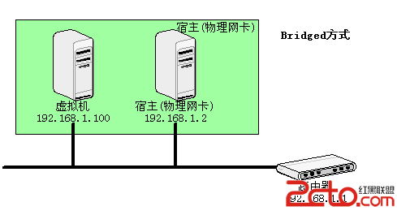
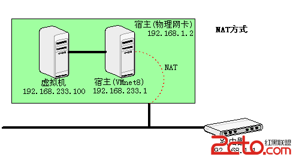
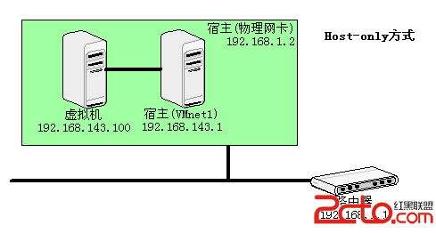

Vmware在安装时默认安装了两块虚拟网卡，VMnet1和VMnet8，另外还有VMnet0。这些虚拟网卡的配置都是由Vmware虚拟机自动生成的，一般来说不需要用户自行设置。
Vmware提供了三种网络连接模式，分别为
<!-- more -->
1.bridged(桥接模式):默认使用VMnet0，不提供DHCP服务

在桥接模式下，虚拟机和宿主计算机处于同等地位，虚拟机就像是一台真实主机一样存在于局域网中。因此在桥接模式下，我们就要像对待其他真实计算机一样为其配置IP、网关、子网掩码等等。
当我们可以自由分配局域网IP时，使用桥接模式就可以虚拟出一台真实存在的主机。

2.NAT(网络地址转换模式):默认使用VMnet8，提供DHCP服务

在NAT模式下，宿主计算机相当于一台开启了DHCP功能的路由器，而虚拟机则是内网中的一台真实主机，通过路由器(宿主计算机)DHCP动态获得网络参数。因此在NAT模式下，虚拟机可以访问外部网络，反之则不行，因为虚拟机属于内网。
使用NAT模式的方便之处在于，我们不需要做任何网络设置，只要宿主计算机可以连接到外部网络，虚拟机也可以。
NAT模式通常也是大学校园网Vmware最普遍采用的连接模式，因为我们一般只能拥有一个外部IP。很显然，在这种情况下，非常适合使用NAT模式。

3.Host-only(主机模式):默认使用VMnet1，提供DHCP服务

在Host-only模式下，相当于虚拟机通过双绞线和宿主计算机直连，而宿主计算机不提供任何路由服务。因此在Host-only模式下，虚拟机可以和宿主计算机互相访问，但是虚拟机无法访问外部网络。
当我们要组成一个与物理网络相隔离的虚拟网络时，无疑非常适合使用Host-only模式。
